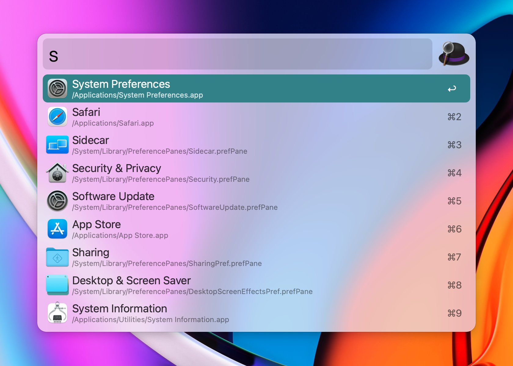
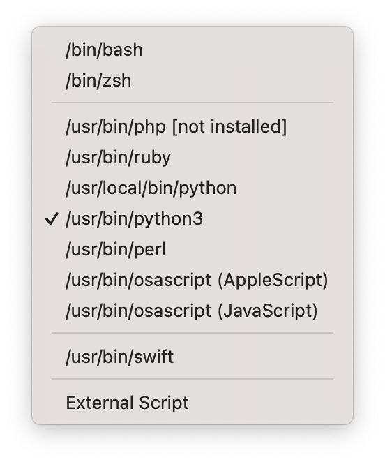
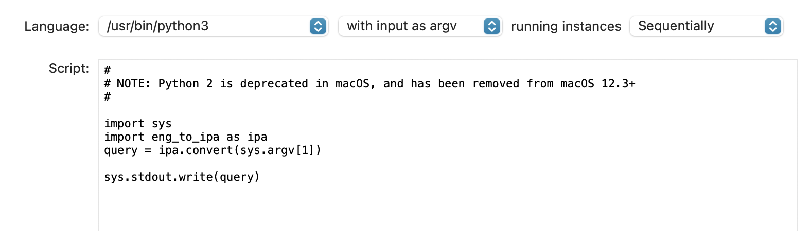

# Alfred

Alfred 的图标，是个英式管家常戴的那种窄边圆礼帽 —— 当初一看到这个名字，就想起来蝙蝠侠的管家，Alfred Pennyworth），也不知道这个软件当初起名字是不是跟这个有关系。

反正，Alfred 真的像是你的系统管家，能帮你干很多很多事情 —— 通过一个跟 Spotlight 相似的一个搜索框，你可以非常快捷地完成很多工作。

```bash
brew install alfred
```



我买的 License 是它的 [Mega Supporter, Free Lifetime Upgrades, £49](https://www.alfredapp.com/shop/) —— 在工具上省钱是没出息的。

它的所有功能里，我最常用的，是剪贴板增强功能，它可以保存你的所有剪贴板历史，当你需要的时候，可以用快捷键 `⇧⌘p` 查看，选择究竟应该粘贴哪个 —— 在此基础上还支持快捷键和搜索……

除此之外，它还有很多功能值得研究。

比如，你想快速完成从 Terminal 到 Finder，或者反之 —— 虽然前面介绍过很多做法 —— 那么，最方便的，就是直接下载一个 Alfred Workflow，[alfred-terminalfinder](https://github.com/LeEnno/alfred-terminalfinder/raw/master/TerminalFinder.alfredworkflow)（右键 `Save as...`）；下载到本地之后，在安装好 Alfred 的情况下，鼠标双击下载好的文件，将其导入 Alfred —— 而后就可以一个快捷键呼出 Alfred Search Box（我为其设置的快捷键是 `⌥ ␣`（Option 和 Space），然后，输入 `tf⮐` 或者反之 `ft⮐` —— 太方便。

再比如说，需要输入一些 Unicode 的时候，官方自带的 Charater View 要多别扭就有多别扭…… 可是，在 Alfred 里安装 [Unicode Text Search Workflow](https://github.com/bevesce/unicode-symbols-search/raw/master/Unicode%20Symbols%20Search.alfredworkflow) 之后，就实在是太方便了，在输入框里输入：`uss four fi↩` （不用等到输入完整的时候，`⅘` 已经排在第一位了）按下回车键的时候，`⅘` 这个字符已经在剪贴板里，并且放到你刚刚正在输入的区域里了……

应该花点时间研究一下 Github 上的 [Awesome Alfred](https://github.com/alfred-workflows/awesome-alfred-workflows) 的仓库，里面有很多方便且必须的 Alfred Workflow……

另外，Alfred 的一些脚本（比如上面提到的 USS）需要 Python@2，但，MacOX 的最近版本中已经废弃了 Python 2.7…… 一个解决方案就是[去官网下载并安装 Python 2.7](https://www.python.org/downloads/release/python-2718/)，之后，在 Alfred 中需要使用 Python 2.7 的时候选择 `/usr/local/bin/python` 作为脚解释器……

Alfred 的 `Run Script` 中，没有办法指定 Python 的安装目录（比如，通过 Homebrew 安装的 Python3）。



XCode 在系统中安装了一个 `/usr/bin/python3` 和 `usr/bin/pip3`，是 Alfred 可以调用的。所以，当需要为这个环境安装模块的时候，要在命令行中执行：

```bash
/usr/bin/pip3 install ....
```

以下是一个例子（用来将英文转换成 IPA 音标 —— 可处理句子）




在此之前，就需要在命令行中用 `/usr/bin/pip3` 安装 `eng-to-ipa` 模块：

```bash
/usr/bin/pip3 install eng-to-ipa     
```

另外，我写了一个 [Window Managment Workflow](https://github.com/xiaolai/Window-Management-alfredworkflow)，可以指定各种快捷键设定当前窗口的尺寸和布局，值得试试……（有了这个之后，我基本放弃了 BetterTouchTool —— 我原本用它做窗口管理。）