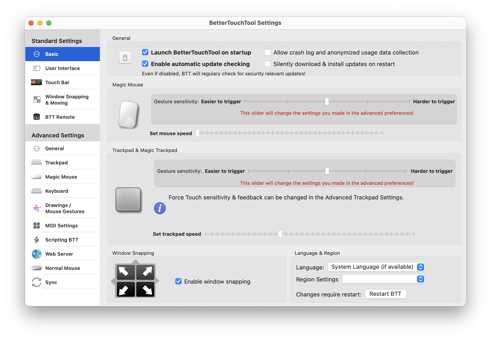
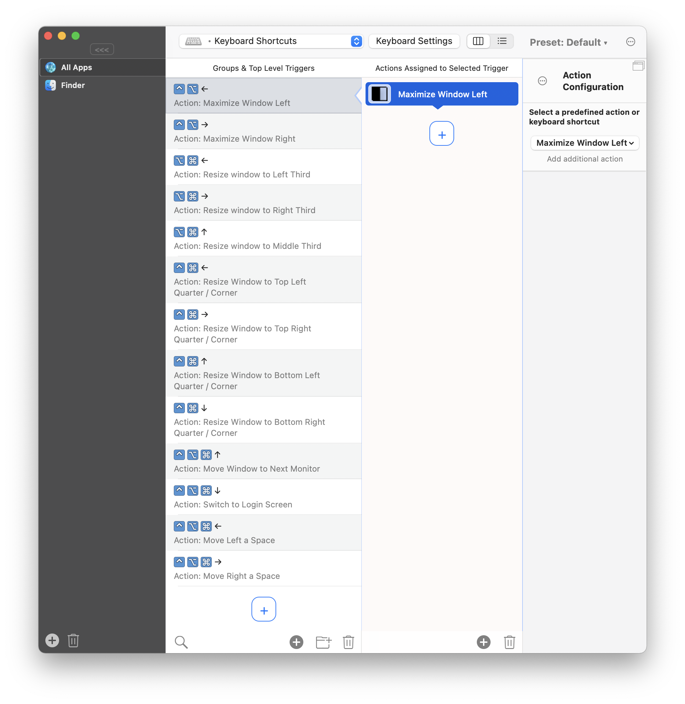
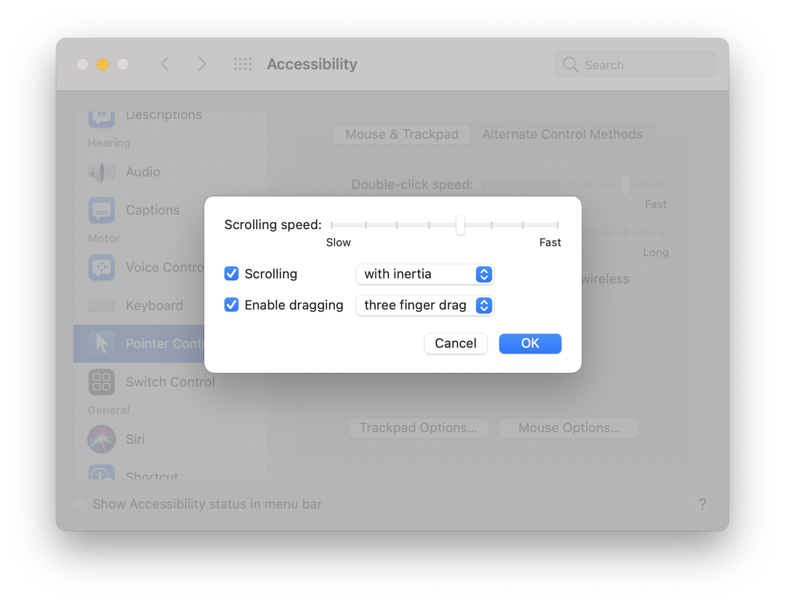

# BetterTouchTool

BetterTouchTool 是个功能非常强大的软件，通过设置键盘和触摸板的快捷方式，可以实现很多细琐但又重要的功能。把它设置成系统登录时自动登录，而后，它就安静地躲在工具条上，随时帮你做些事情。

```bash
brew install bettertouchtool
```



—— `Luanch BetterTouchTool on startup` 之前打勾。

在它众多的功能之中，我使用最为频繁的是用它设置快捷键去控制程序窗口，比如，用键盘控制当前正在使用的程序窗口，让它靠近左半边放大，或者靠右占屏 ⅓，将窗口挪到另外一个显示器，或者另外一个桌面等等……



在这张设置截图里，就能看到我是为每个动作设置了哪个快捷键的，比如，`⌥⌘→` 就是我用来把窗靠右边占屏 ⅓ 的快捷键。我依次为屏幕二分、三分、四分设置了不同的快捷键。每个快捷键都多试几遍，就基本上能记住了。


在这张截图里，是我为触摸板设置的几个动作快捷方式。需要说明一下的是 TipTap Left（2 Fingers Fix），是这样一个动作：

> * 三指轻放在触摸板上（我用食指、中指、无名指）
> * 在中指和无名指不动的情况下，抬起食指，轻点一下触摸板

 TipTap Middle（2 Fingers Fix），是这样一个动作：

> * 三指轻放在触摸板上（我用食指、中指、无名指）
> * 在食指和无名指不动的情况下，抬起中指，轻点一下触摸板

我用这两个动作替代了系统的三指左划和三指右划 —— 这在浏览器中相当于是「上一页」和「下一页」，挺省心省力的。

它的设置可能看起来比较麻烦，不过，你需要做的只不过是：

1. [购买一个付费许可](https://folivora.ai/buy)，我买的是 LIFE TIME LICENSE，$20.5；
2. 下载并导入[我的 presets](https://raw.githubusercontent.com/xiaolai/apple-computer-literacy/main/files/xiaolai.bttpreset)（使用鼠标右键，选择 `Save as...`），voila! 你一下子多了很多快捷键可用……

另外，说到「窗口管理」，一个必须设置的就是拖动窗口的快捷方式。在 Mac 上，我更习惯使用触摸板而不是鼠标。所以，「三指拖动窗口」对我来说，是必需的功能设置。`System Preferences → Accessibility → Pointer Control → Trackpad Options... → Enable dragging → three finger drag`：



另外，在多个 Desktop Space 之间切换有系统内建的快捷键：

> * `⌃ ←` 或在触摸板上四指左滑，切换到前一个 Desktop Space
> * `⌃ →` 或在触摸板上四指右滑，切换到后一个 Desktop Space
> * `⌃ ↑` 或在触摸板上四指上滑，切换到 Misson Control 模式，查看所有窗口和 Desktop Space
> * `⌃ ↓` 或在触摸板上四指下滑，返回当前 Desktop Space

[点击这里](https://support.apple.com/en-hk/guide/mac-help/mh14112/mac)查看 Desktop Space 的官方说明。