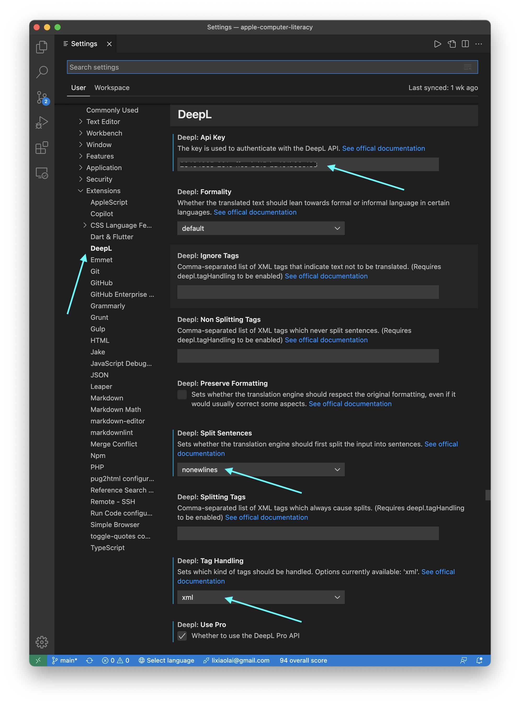

# 翻译工作环境

首先当然是 DeepL 的付费版。（国内的人，找个国外的朋友代为支付即可…… 在美国的、在日本的，都行。）

> **注意**：最佳的购买方案是购买 “For Developers” 标签内的 “DeepL API Pro”，价格仅为 $5.49/月。只有这个方案提供 API，才可以配合 VSCode 里的 DeepL 插件使用。“For individuals and teams” 里的 DeepL Pro 购买方案，提供的是 “Authentication Key for CAT tools”，不是能程序化调用的 “Authentication Key for API”…… 我竟然是在选错方案一个多月之后才反应过来。

>> **另外**：使用 DeepL API Pro 版本的购买方案之后，DeepL 桌面版依然有它的用处 —— 于是，我注册了两个账号分别付费，一个账号购买了 DeepL Pro，另外一个账号购买了 DeepL API Pro…… 于是，下文中为了批处理在 Alfred 中设置的快捷键，以及在 VSCode 中设置的快捷键，要注意区分开来。我在 Alfred 中为 “翻译当前光标所处的段落” 设置的快捷键是 `⇧ + ⌃ + P`，在 VSCode 中设置的快捷键是 `⌃ + ⌥ + ⌘ + P`。

> 

其次是文字编辑器的选择。我选择的是 [Visual Studio Code](https://code.visualstudio.com/) —— 这是一个面向程序员设计的纯文本编辑器，但，并非只有程序员们才是用它…… 在进行翻译的时候，它成了最好的选择 —— 因为电子书目前最常见的格式都可以转换成 `html` 文本，用 MS Word 之类的编辑器事实上是很差的选择。比如，`⌘+D` 可以选中多个相同的字符串而后对它们同时编辑 —— 这样的功能，MS Word 之类的 “专业字处理器” 根本就没有，更别说它蹩脚的正则表达式搜索替换功能了（没办法跨文件处理）…… 当然，VSCode 还可以安装各种插件，做更多事情，比如，可以做很多批处理 —— 不可或缺的功能。

## 电子书转换路径

我的电子书获取路径大致如下：

> Kindle > ePubor Ultimate > Calibre > htmz > vscode editing.

我都是在 Amazon 上直接买，而后在电脑上安装一个老版本的 Kindle App，用鼠标右键点击书名，下载，并不打开该电子书，而后退出 Kindle。

[ePubor Ultimate](https://www.epubor.com/) 也是个收费软件，能把旧版 Kindle 下载的电子书的 DRM 去掉；将 `awz` 文件转换成 `epub` 文件。（可参考这个[网页](https://www.epubor.com/how-to-downgrade-kindle-for-pcmac.html)）

然后，再用免费软件 [Calibre](https://calibre-ebook.com/) 将 `epub` 转换成 `htmlz` 文件（一个压缩包）。（我尝试过使用命令行工具包 [pandoc](https://pandoc.org/)，但，比较之后，发现 Calibre 在保留样式方面可能更好一点……）

最后，再在 Terminal 里用 `unzip` 命令将 `htmlz` 文件解压缩。

整理一下文件夹，休整并补充一下 `style.css`，配上 `toc.css` 和 `toc.js`；最终，形成一个左侧带有固定目录（方便浏览和编辑时跳转）的 `html` 文件……（这一步可以最后做，见最后一节）

## 清理 Calibre 生成的 html 文件

每本电子书被 Calibre 转换成 html 之后，文件内的各种 tag 分布各不相同。

为了编辑方便，经常需要 1）将诸如 `<div class="p-indent">...</div>` 或者 `<p class="xxx">...</p>` 转换成一行内，以便可以整行直接搬运到 DeepL 翻译。可以用 Jupyter 里用 Python 以及 BeautifulSoup 包完成：

``` python
import bs4
filePath = "<file's full path>"
html = open(filePath)
soup = bs4.BeautifulSoup(html.read())
# 把所有 div 的内容整理成一行
for div in soup.find_all("div", class_=["p", "p-indent", "p-blocktext"]):
  div = str(div).replace("\n", "")
text = str(soup).replace("\n", "")
```

随后，可以将 text 拷贝到剪贴板，或者直接写入某个指定的文件……

另外，经常有大量没有具体意义的`<span>...</span>`。去掉他们的方法是，先用 VSCode 搜索 `<span>` 将它们替换成 `<span class="none">`，而后再用 BeautifulSoup 给去掉：

``` python
for span in soup.find_all("span", class_="none"):
  span.unwrap()
```

## 浏览器自动重载（Auto-reload）

* 为系统安装 nodejs 和 browser-sync
* 为浏览器（Microsoft Edge 或者 Google Chrome）安装 Live Load 插件
* 在 VSCode 中用快捷键 ```Ctrl + ` ``` 呼出显示在编辑器区域下部的 Terminal，输入 `serve` 命令……

> 更多参见这篇文章：
>
> [https://medium.com/@svinkle/start-a-local-live-reload-web-server-with-one-command-72f99bc6e855](https://medium.com/@svinkle/start-a-local-live-reload-web-server-with-one-command-72f99bc6e855)

## VS Code 插件

VSCode 的插件有很多，为了翻译任务，我只增加了以下三个插件。

* Chinese Translation（有时候 DeepL 会在简体中文中包含一些繁体中文内容，可以用这个插件提供的功能快速转换）
* DeepL for Visual Studio Code（DeepL 的付费用户才能用到这个插件）
* ssmacro（为 VSCode 提供 “批处理” 功能；对翻译工作来说，最重要的就是用它执行一系列的正则表达式替换）

## DeepL 插件的设置

为了保留原电子书中的大量的引用链接，通常我们是在转换并清理过的 `html` 文件里工作。DeepL 的插件允许为 API 调用做一些设置，比如，`tag_handlling=xml`。

安装好 DeepL 插件之后，用快捷键 `⌘ + ,` 呼出 Settings，在 Extensions 中找到 `DeepL`，而后如下图所示进行设置：



如此这般之后，选中任何文字，都可以使用快捷键 `⌥ + t` 进行翻译。

而后，我在 `keybindings.json` 中增加了一个快捷键，调用一个 ssmacro 的批处理：

```json
  {
    "key": "ctrl+alt+cmd+p",
    "command": "ssmacro.macro",
    "args": {"file": "deepl_translate.json"},
    "when": "editorTextFocus"
  },
```

而 `deepl_translate.json` 的内容如下：

```json
[
  {
    "command": "expandLineSelection"
  },
  {
    "command": "editor.action.duplicateSelection"
  },
  {
    "command": "ssmacro.left"
  },
  {
    "command": "editor.action.insertLineBefore"
  },
  {
    "command": "ssmacro.right"
  },
  {
    "command": "expandLineSelection"
  },  
  {
    "command": "deepl.translate"
  }
]
```
以上的 Macro 是执行以下任务：

> 1. 选中当前行；
> 2. 将当前行再复制一份放在下面；
> 3. 光标挪到新复制的那一行的开头；
> 4. 在光标前增加一个空行；
> 5. 确保光标仍在新复制的那一行之内；
> 6. 选中新复制的那一行
> 7. 发送至 DeepL 等待返回结果覆盖新复制的那一行；


## 中文排版要点

中文字体本质上是“等宽字体”，因此排版有个特别的 “小技巧”，设定一个较小的字间距就能做到很舒服：

```css
cn {
  letter-spacing: 0.1 em;
}
```

在中英文混排的时候，这比较难办…… 等我找时间研究一下 javascript 动态识别中文字符再说……

以下是我在中文排版时的 “强迫症”：

> * `"` 要相应地替换成 `“”`
> * `'` 要相应地替换成 `‘’`
> * 无论是单引号还是双引号，都要与相邻的字符之间留有一个空格；标点符号 `，。？！` 除外；
> * 数字、百分比、英文字母，与汉字之间应该应该留有空格；
> * 应用在中文字符的 “斜体” 样式，应该改成 “加重” 样式；
> * 破折号统一使用 `——`（前后有空格，除非与标点符号相邻）而非 `&mdash;` 或者 `--`；
> * 外国姓名之间的符号为 `·`；
> * ……

要满足这点强迫症，手动编辑常常近乎不可能。只能靠工具。在 VSCode 里，我是找了个叫做 `ssmacro`（Super Simple Macro）的插件，把需要的 “搜索替换正则表达式” 罗列出来，而后设置一个快捷键 —— 让这些任务 “一键完成”……

## 一些代码

### vscode-deepl automation

DeepL 的软件上，`Insert to...` 是一个链接，并没有给出快捷键。于是，需要写个 AppleScript，模拟鼠标点击，而后可以用 Alfred 软件给这个脚本设定个快捷键（我设置的快捷键是 “ctrl+alt+cmd+p”）：


```applescript
tell application "Visual Studio Code"
	activate
	delay 2
	tell application "System Events"
		key code 37 using command down
		delay 1
		key code 8 using command down
		key code 8 using command down
	end tell
end tell
-- 以上是 cmd+l 选中当前整行；而后连续两次 cmd+c 将选中文字发给 DeepL

delay 5

tell application "Visual Studio Code"
	activate
	delay 2
	tell application "System Events"
		key code 124 using command down
		key code 124 using command down
		key code 36 using command down
	end tell
end tell

-- 以上是在 VSCode 中输入两个空行

-- 以下是模拟鼠标点击，按 DeepL 上的 “Insert to...” 链接
-- 也可以将以下部分，独立出来，单独为 “Insert to...” 设置个快捷键（我设置的是 “ctrl+alt+cmd+i”）
tell application "System Events"
	tell process "DeepL" to tell window 1
		activate
		set w_position to its position
		set w_size to its size
	end tell
end tell

set px to item 1 of w_position
set py to item 2 of w_position
set sx to item 1 of w_size
set sy to item 2 of w_size

tell application "System Events"
	click at {px + sx - 190, py + sy - 95} -- Insert to link
end tell
```

### 各种为翻译工作设定的快捷键

注意：在使用 VSCode 的时候，如果某些快捷键不起作用，很可能是因为 “当前输入法处于中文输入状态” 造成的。切换成英文输入法状态就好了…… 我最初的时候，设置了个快捷键，`ctrl+cmd+alt+\\`，这个快捷键就遇到了 “与输入法” 有所冲突的情况。后来，将这个快捷键改成了 `ctrl+cmd+alt+o`，就不受输入法影响了。

`keybindings.json`

```json
[
  {
    "key": "ctrl+shift+9",
    "command": "editor.action.insertSnippet",
    "args": {"snippet": "（$TM_SELECTED_TEXT$0）"},
    "when": "editorTextFocus&&editorHasSelection"
  },
  {
    "key": "ctrl+shift+'",
    "command": "editor.action.insertSnippet",
    "args": {"snippet": "“$TM_SELECTED_TEXT$0”"},
    "when": "editorTextFocus&&editorHasSelection"
  },
  {
    "key": "ctrl+'",
    "command": "editor.action.insertSnippet",
    "args": {"snippet": "‘$TM_SELECTED_TEXT$0’"},
    "when": "editorTextFocus&&editorHasSelection"
  },
  {
    "key": "ctrl+shift+[Backslash]",
    "command": "editor.action.insertSnippet",
    "args": {"snippet": "【$TM_SELECTED_TEXT$0】"},
    "when": "editorTextFocus&&editorHasSelection"
  },
  {
    "key": "ctrl+shift+[Slash]",
    "command": "editor.action.insertSnippet",
    "args": {"snippet": "《$TM_SELECTED_TEXT$0》"},
    "when": "editorTextFocus&&editorHasSelection"
  },
  {
    "key": "ctrl+shift+[BracketRight]",
    "command": "editor.action.insertSnippet",
    "args": {"snippet": "「$TM_SELECTED_TEXT$0」"},
    "when": "editorTextFocus&&editorHasSelection"
  },
  {
    "key": "ctrl+shift+[BracketLeft]",
    "command": "editor.action.insertSnippet",
    "args": {"snippet": "『$TM_SELECTED_TEXT$0』"},
    "when": "editorTextFocus&&editorHasSelection"
  },
  {
    "key": "ctrl+alt+cmd+-",
    "command": "editor.action.insertSnippet",
    "args": {"snippet": " —— "},
    "when": "editorTextFocus&&editorHasSelection"
  },
  {
    "key": "ctrl+shift+=",
    "command": "editor.action.insertSnippet",
    "args": {"snippet": " $TM_SELECTED_TEXT$0 "},
    "when": "editorTextFocus&&editorHasSelection"
  },
  {
    "key": "ctrl+shift+-",
    "command": "editor.action.insertSnippet",
    "args": {"snippet": "<p></p>"},
    "when": "editorTextFocus"
  },
  {
    "key": "ctrl+alt+cmd+a",
    "command": "editor.action.insertSnippet",
    "args": {"snippet": "<a href=\"\" target=\"_blank\">$TM_SELECTED_TEXT$0</a>"},
    "when": "editorTextFocus&&editorHasSelection&&editorLangId==html"
  },  
  {
    "key": "shift+ctrl+b",
    "command": "editor.action.insertSnippet",
    "args": {"snippet": "<strong>$TM_SELECTED_TEXT$0</strong>"},
    "when": "editorTextFocus&&editorHasSelection&&editorLangId==html"
  },
  {
    "key": "shift+ctrl+i",
    "command": "editor.action.insertSnippet",
    "args": {"snippet": "<em>$TM_SELECTED_TEXT$0</em>"},
    "when": "editorTextFocus&&editorHasSelection&&editorLangId==html"
  },
  {
    "key": "shift+ctrl+u",
    "command": "editor.action.insertSnippet",
    "args": {"snippet": "<u>$TM_SELECTED_TEXT$0</u>"},
    "when": "editorTextFocus&&editorHasSelection&&editorLangId==html"
  },
  {
    "key": "shift+ctrl+d",
    "command": "editor.action.insertSnippet",
    "args": {"snippet": "<del>$TM_SELECTED_TEXT$0</del>"},
    "when": "editorTextFocus&&editorHasSelection&&editorLangId==html"
  },{
    "key": "ctrl+tab",
    "command": "cursorRight",
    "when": "editorTextFocus&&!editorHasSelection"
  },
  {
    "key": "ctrl+alt+cmd+backspace",
    "command": "editor.emmet.action.removeTag"
  },
  {
    "key": "ctrl+shift+right",
    "command": "editor.emmet.action.matchTag",
    "when": "editorTextFocus&&editorLangId==html"
  },
  {
    "key": "ctrl+shift+l",
    "command": "editor.emmet.action.wrapWithAbbreviation"
  },
  {
    "key": "cmd+k b",
    "command": "workbench.action.toggleSidebarVisibility"
  },
  {
    "key": "shift+alt+d",
    "command": "editor.action.duplicateSelection"
  }
  ,{
    "key": "ctrl+alt+cmd+o",
    "command": "ssmacro.macro",
    "args": {"file": "regex.json"},
    "when": "editorTextFocus"
  }
]
```

以上的最后一段：

```json
  {
    "key": "ctrl+alt+cmd+o",
    "command": "ssmacro.macro",
    "args": {"file": "regex.json"},
    "when": "editorTextFocus"
  }
```

其中的 `“args”: {“file”:“regex.json”},` 有两种写法，一个是像这样用 `“file”:` 指定，那么这个文件应该在 `$HOME/.vscode/extensions/joekon.ssmacro-0.6.0/macros/` 文件夹内；第二种写法使用 `“path”:`，然后在其后设定批处理文件（`json`文件）的绝对路径。

### 为 ssmacro 设定的正则表达式批处理

```json
[
  {
    "command": "expandLineSelection"
  },
  {
    "command": "ssmacro.replace",
    "args": {
        "info": "半角方括号",
        "find": "\\[(.*?)\\]",
        "replace": "$1",
        "all": false,
        "reg": true,
        "flag": "gm"
    }
  },  
  {
    "command": "ssmacro.replace",
    "args": {
        "info": "直引号变成弯引号",
        "find": "\\s*\"(.*?)\\s*\"",
        "replace": "“$1”",
        "all": false,
        "reg": true,
        "flag": "gm"
    }
  },
  {
    "command": "ssmacro.replace",
    "args": {
        "info": "直引号变成弯引号",
        "find": "\\s*'(.*?)\\s*'",
        "replace": "‘$1’",
        "all": false,
        "reg": true,
        "flag": "gm"
    }
  },
  {
    "command": "ssmacro.replace",
    "args": {
        "info": "上一步误伤的直引号",
        "find": "=“(.*?)”",
        "replace": "=\"$1\"",
        "all": false,
        "reg": true,
        "flag": "gm"
    }
  },  
  {
    "command": "ssmacro.replace",
    "args": {
        "info": "弯引号之前的空格",
        "find": "([\u4e00-\u9fa5])“",
        "replace": "$1 “",
        "all": false,
        "reg": true,
        "flag": "gm"
    }
  },  
  {
    "command": "ssmacro.replace",
    "args": {
        "info": "弯引号之后的空格",
        "find": "”([\u4e00-\u9fa5])",
        "replace": "” $1",
        "all": false,
        "reg": true,
        "flag": "gm"
    }
  },

  {
    "command": "ssmacro.replace",
    "args": {
        "info": "中文斜体转换成中文加重",
        "find": "<i (.*?)>([\u4e00-\u9fa5]+)</i>",
        "replace": "<strong $1>$2</strong>",
        "all": false,
        "reg": true,
        "flag": "gm"
    }
  },
  {
    "command": "ssmacro.replace",
    "args": {
        "info": "省略号",
        "find": "\\.{2,}\\s*。*\\s*",
        "replace": "…… ",
        "all": false,
        "reg": true,
        "flag": "gm"
    }
  },
  {
    "command": "ssmacro.replace",
    "args": {
        "info": "破折号",
        "find": "&mdash；|—|--",
        "replace": " —— ",
        "all": false,
        "reg": true,
        "flag": "gm"
    }
  },
  {
    "command": "ssmacro.replace",
    "args": {
        "info": "姓名之间的 ·",
        "find": "([\u4e00-\u9fa5])-([\u4e00-\u9fa5])",
        "replace": "$1·$2",
        "all": false,
        "reg": true,
        "flag": "gm"
    }
  },
  {
    "command": "ssmacro.replace",
    "args": {
        "info": "姓名之间的 ·",
        "find": "([\u4e00-\u9fa5])-([\u4e00-\u9fa5])",
        "replace": "$1·$2",
        "all": false,
        "reg": true,
        "flag": "gm"
    }
  },
  {
    "command": "ssmacro.replace",
    "args": {
        "info": "数字前的空格",
        "find": "([\u4e00-\u9fa5])(\\d)",
        "replace": "$1 $2",
        "all": false,
        "reg": true,
        "flag": "gm"
    }
  },
  {
    "command": "ssmacro.replace",
    "args": {
        "info": "数字后的空格 —— 含 %",
        "find": "([\\d%])([\u4e00-\u9fa5])",
        "replace": "$1 $2",
        "all": false,
        "reg": true,
        "flag": "gm"
    }
  },
  {
    "command": "ssmacro.replace",
    "args": {
        "info": "英文字母前的空格",
        "find": "([\u4e00-\u9fa5])(\\w)",
        "replace": "$1 $2",
        "all": false,
        "reg": true,
        "flag": "gm"
    }
  },   
  {
    "command": "ssmacro.replace",
    "args": {
        "info": "英文字母后的空格",
        "find": "(\\w)([\u4e00-\u9fa5])",
        "replace": "$1 $2",
        "all": false,
        "reg": true,
        "flag": "gm"
    }
  },
  {
    "command": "ssmacro.replace",
    "args": {
        "info": "后：斜体英文与汉字之间的空格",
        "find": "([\u4e00-\u9fa5])<i",
        "replace": "$1 <i",
        "all": false,
        "reg": true,
        "flag": "gm"
    }
  },
  {
    "command": "ssmacro.replace",
    "args": {
        "info": "前：斜体英文与汉字之间的空格",
        "find": "i>([\u4e00-\u9fa5])",
        "replace": "i> $1",
        "all": false,
        "reg": true,
        "flag": "gm"
    }
  },
  {
    "command": "ssmacro.replace",
    "args": {
        "info": "双引号前的逗号",
        "find": "，”",
        "replace": "”，",
        "all": false,
        "reg": true,
        "flag": "gm"
    }
  },
  {
    "command": "ssmacro.replace",
    "args": {
        "info": "逗号、句号、感叹号、问号后面多余的空格",
        "find": "([，。！？]) ",
        "replace": "$1",
        "all": false,
        "reg": true,
        "flag": "gm"
    }
  },
  {
    "command": "ssmacro.right"
  }
]
```

用 ssmacro 批处理进行正则表达式替换的效果大致如下：


## html 样式整理

可以把 `./../images/` 文件夹重命名为 `./assets/`，而后把 `style.css`、`toc.css`、`toc.js` 都放到 `./assets/` 文件夹中。

以下是所需文件的“示例：

> * [style.css](files/style.css)
> * [toc.css](files/toc.css)
> * [toc.js](files/toc.js)

把 `./../images/` 文件夹重命名为 `./assets/` 之后，记得要 search `../images/` 而后 replace `assets/`。


将以下两行插入到 `<head> </head>` 之间：
```html
  <link href="./assets/style.css" rel="stylesheet" type="text/css" />
  <link href="./assets/toc.css" rel="stylesheet" type="text/css" />
```

将以下五行插入 `</body>` 之间：
```html
<script src="./assets/toc.js" ></script>
<script>
  console.log('load')
  buildTOC('.contents', '.toc')
</script>
```

调整一下 `body` tag 之间的结构：

```html
<body>
  <div class="header">
    <!-- 这里是顶部横幅（例如：固定书籍标题） -->
  </div>
  <div class="main">
    <div class="toc">
      <!-- 这里是手动添加或者只剩生成的 Table of Contents -->
    </div>
    <div class="contents">
      <!-- 这里是书籍内容 -->
    </div>
  </div>
</body>
```

Calibre 生成的 `style.css` 可以根据自己的偏好调整，比如，我加了一些样式，正如你在这个示例 [style.css](files/style.css) 里看到的那样 ：

```css
.header{
    background-color: #eee;
    position: fixed;
    /* Set the navbar to fixed position */
    top: -30px;
    left: -50px;
    /* Position the navbar at the top of the page */
    width: 120%;
    /* Full width */
    /* border-bottom: 1px solid #752828; */
    background: url(assets/background.jpg) #C51216;
    /* 并不需要这个 background.jpg 存在，只是 “占位” */
}

.header h1{
    color: white;
    text-align: center;
    font-size: 40px;
    padding-top: 30px;
}

.toc {
    width: 15%;   /* .toc 和 .contents 的宽度加起来应该等于 90% */
    position: fixed;
    overflow-x: hidden;
    overflow-y: auto;
    padding-left: 30px;
    height: 100vh;
    padding-top: 50px;
}

.contents {
    margin-top: 100px;  /* 这是给顶部固定横幅预留的高度 */
    margin-left: 20%;
    padding-top: 50px;
    width: 75%;   /* .toc 和 .contents 的宽度加起来应该等于 90% */
}

p{
    letter-spacing: 0.1em;  /* 这是中文字符排版的 “秘籍” */
    font-size: 18px;
    font-family: 'Kaiti SC', Georgia, 'Times New Roman', Times, serif;
}

img {
    height: auto !important;
    width: 95% !important;
    text-align: center;
}
```