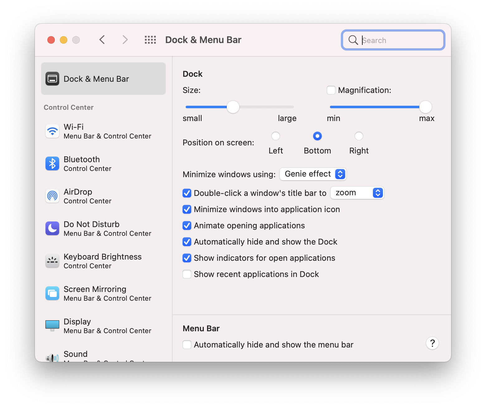

# Dock 

Dock 上一排图标大多数情况下并没有实际的用处 —— 除了碍眼之外。LaunchPad 都是没用的，因为打开程序什么的，基本上都是用 Spotlight 完成（或者用 Alfred 替代）。最近打开的程序，被固定在 Dock 上更是讨厌。

在 `System Preference > Dock & Menu Bar` 里，把 `Show recent applications in Dock` 前面的勾去掉：



然后在 Terminal 里执行以下命令：

```bash
defaults write com.apple.dock persistent-apps -array; killall Dock
```

…… 一下子清爽了！


关于 MacOS 的各种 “默认设置”，参见：

> https://macos-defaults.com/
