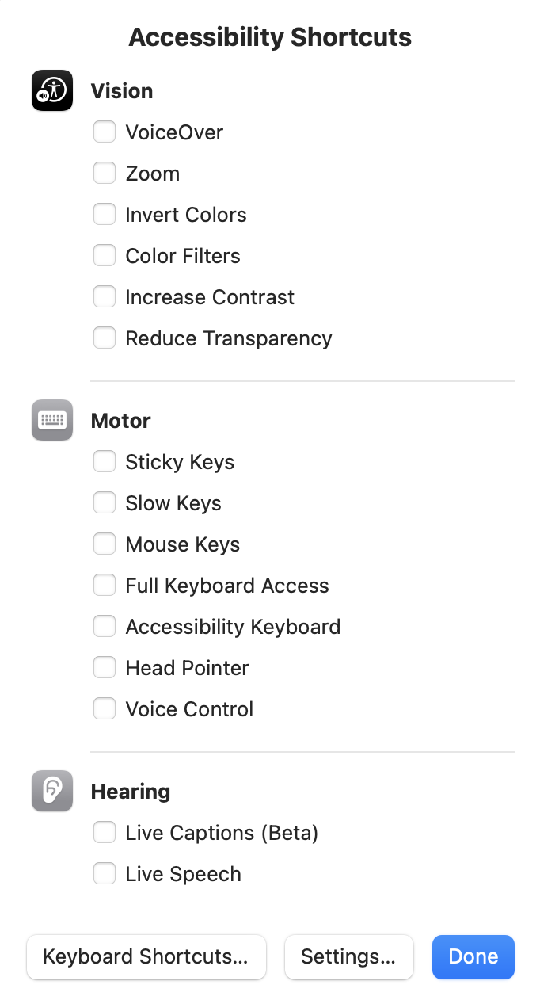

# 把屏幕变成 “墨水屏”

长时间面对屏幕写作的时候，眼睛的确容易累。在非编程的场景下，黑白屏幕可能更舒服 —— 因为蓝光就是最重要的伤眼因素。编程的场景下，不太适合用 “墨水屏”，因为代码高亮（用各种颜色区分文本）还是很管用的。

macOS 系统有个快捷键，`Option + Command + F5`，可以呼出 Accessibility Shortcuts 对话框：



`Vision` 区里的 `Color Filters` 之前的勾选，就是用来在 “彩色/黑白” 模式中切换的。

如果还嫌麻烦，可以用以下命令安装 [Grayscale](https://github.com/brettferdosi/grayscale)，一个可以驻留在工具栏的小工具，可为 “彩色/黑白” 模式切换设置快捷键，比如 `Shift + Option + Command + Space`：

```bash
brew install --cask --no-quarantine brettferdosi/tap/grayscale
```

安装完毕之后，还可以去 `System Preference > Login Items` 里把 Grayscale 这个应用添加到 `Open at Login` 列表中去。