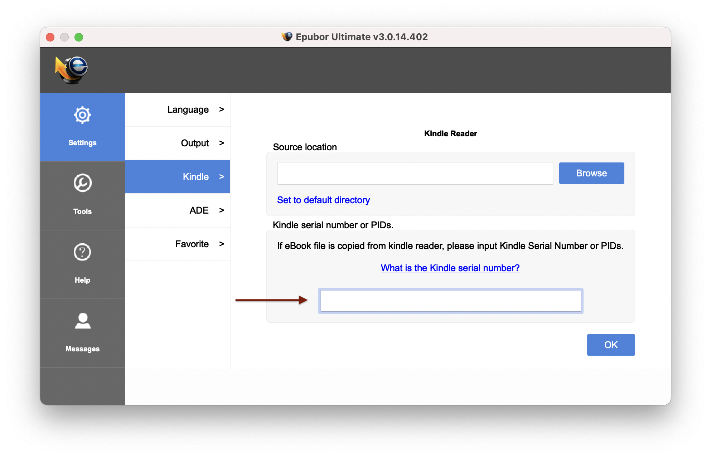
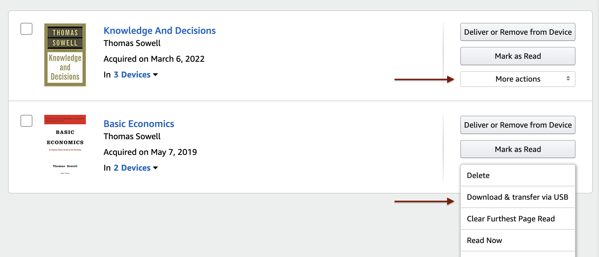
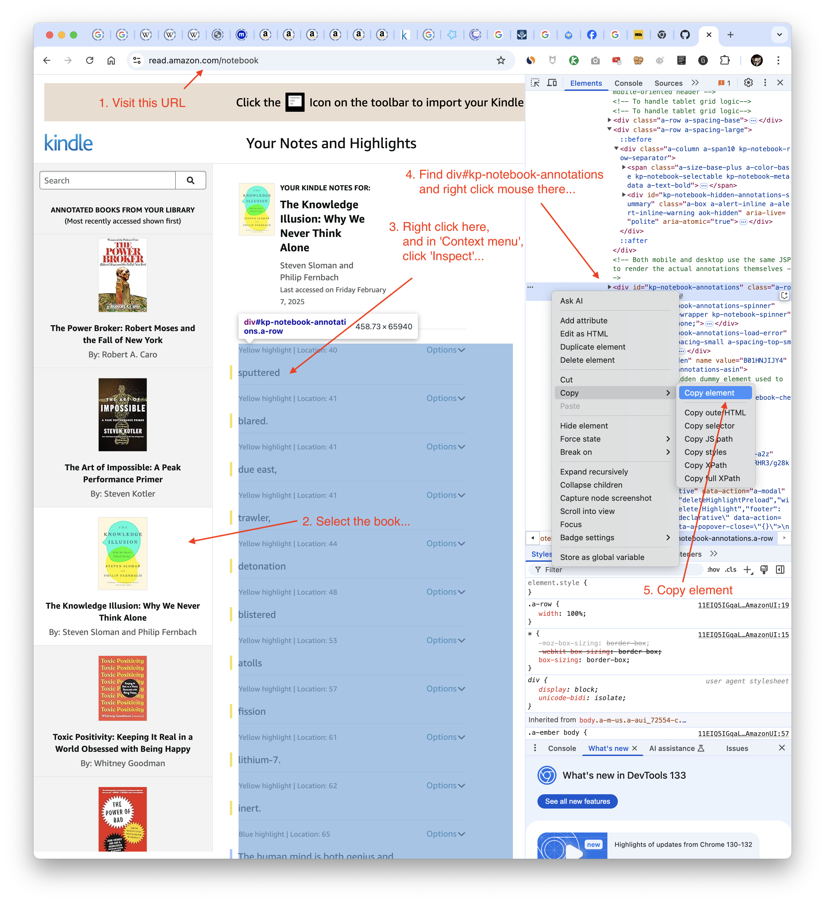

# 与 Kindle/Audible 有关的话题

### 1. epub

Kindle 书籍 (`awz3` 文件）是有 DRM 加密的（digital rights management）。但，自己购买的书，还是有办法解密并转换成 epub 格式，只不过，麻烦一点，贵一点。

首先是得购买一个 Kindle 物理设备 —— 这样你才会有一个 `Serial Number` —— 在设备的设置中，或者 Amazon 的 [Device Managment](https://www.amazon.com/hz/mycd/digital-console/alldevices) 页面中能够找到。

我用的是收费软件 [ePubor](https://www.epubor.com/)。在它的设置中，填写你的 `Kindle Device Serial Number`：



而后就可以用 Epubor 将自己购买的书籍从 `awz3` 文件转换为 `epub` 格式了；至于已购书籍文件，可以在 Amanzon 网站中的 [Content Management](https://www.amazon.com/hz/mycd/digital-console/contentlist/allcontent/dateDsc) 中下载。



### 2. mp3

收费软件 [OpenAudible](https://openaudible.org/) 可以经过 Amazon 登录授权之后，将所有已购有声书下载到本地，并将其转换成 `mp3/m4a/m4b` 格式。

### 3. Calibre

我自己是用命令行的 pandoc 处理 `epub` 格式转换（比如转换成可编辑的 html），但，更多人可能需要图形界面，那就只能是 [Calibre](https://calibre-ebook.com/) 了。

```bash
brew install --cask calibre
```

有了 [DeepL](https://www.deepl.com) 之后，我购书不再只限于英文了，因为任何语言的书都可以转换格式之后提交 DeepL 自动翻译，还可以写脚本处理文本渲染格式。

### 4. Whisper

Whisper 是 [OpenAI](https://openai.com) 推出的语音转换文字的人工智能工具包，支持很多种语言。在 github 上，有一个项目，[Whisper Auto Transcribe](https://github.com/tomchang25/whisper-auto-transcribe)，在本地机器上配置好 Python 环境之后，就可以用这个软件为 `mp3` 有声书配上 “字幕”（`srt`、`vtt` 格式）。在我的 Macbook Air M2 上，文字转换时间大约比有声书的总时长稍微短一点，如果有条件用 GPU 加速的话，一本 14 小时的书，差不多 40 分钟就能弄完。

### 5. iina

[iina](https://iina.io/) 是一款基于 [mpv](https://mpv.io/) 的媒体播放器，界面很好看。

```bash
brew install --cask iina
```

在 iina 的设置里，`iina → Settings → Advanced`：

* 开启 `Enable advanced settings`
* 勾选 `Use config directory`

创建 mpv 的设置文件，在 `~/.config/mpv/mpv.conf` 文件中添加以下内容：

```
[extension.mp3]
profile-desc="profile for audiobooks"
audio-display=external-first
cover-art-auto=all
sub-auto=all
sub-align-x=left
sub-margin-x=100
sub-pos=85
sub-font-size=50
save-position-on-quit=yes
stop-screensaver=always
```

播放 `mp3` 有声书的时候，`mp3` 文件、`srt` 文件，以及一个封面图片文件放在同一个目录：

```code
.
├── Basic Economics, Fifth Edition.mp3
├── Basic Economics, Fifth Edition.srt
└── audiobook.png
```

然后用 iina 打开 `mp3` 文件：


有用的快捷键：

* 转到上一条字幕位置: `Shift + Left`

* 转到下一条字幕位置: `Shift + Right`
* 音乐播放模式转换: `Option + Command + m`
* 放大窗口: `Command + =`
* 缩小窗口: `Command + -`

### 6. Kindle Annotations

在 Kindle 上，阅读过程中做的各种标记（Annotation），官方一直没有给出很好的导出方法（移动版上有通过邮件方式导出的方式 —— 真不知道开发者怎么想的）。

但，可以通过访问 https://read.amazon.com/notebook ，然后再手动拷贝出某本书的标记，而后保存为 `.html` 文件，再想办法用 python 处理…… 虽然有点麻烦，但也没啥办法，我一直这么做 —— 具体步骤如下图所示：



我用以下函数提取特定颜色的标记文本（默认选择 `yellow`）：

```python
from bs4 import BeautifulSoup

def extract_kindle_annotations(file_path, color="yellow"):
    # Read the HTML file
    with open(file_path, 'r', encoding='utf-8') as file:
        html_content = file.read()
    # Parse HTML with BeautifulSoup
    soup = BeautifulSoup(html_content, 'html.parser')
    # Initialize lists to store annotations and their colors
    annotations = []
    # Find highlights for current color
    highlights = soup.find_all('div', class_=f'kp-notebook-highlight-{color}')
    # Extract text from each highlight
    for highlight in highlights:
        annotations.append(highlight.get_text().strip())
    return annotations
```


----
