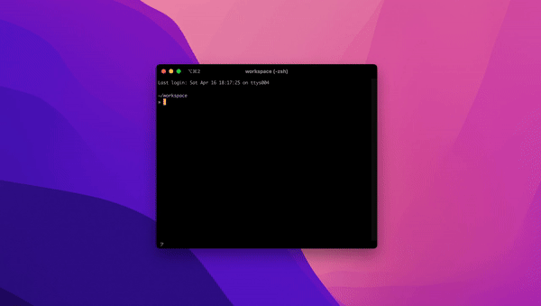

# Miscellaneous

## 1. 鼠标点击任何位置移动窗口

从 MacOS High Sierra 开始，可以将窗口移动动作设置为 “用鼠标点击窗口任意位置进行拖动”（而非 “必须通过点击并拖动窗口标题栏”）—— 就好像是在 Linux 操作系统那样……



在 Terminal 中输入：

```bash
defaults write -g NSWindowShouldDragOnGesture -bool true
```

而后重新登录系统。

取消以上操作的方式是，在 Terminal 中输入：

```bash
defaults delete -g NSWindowShouldDragOnGesture
```

## 2. 特殊文件夹图标

在用户根目录下 `~` 创建一个文件夹，名为 `Developer`，而后在 Finder 中将其拖至侧边栏，将得到一个画有系统内建图标的文件夹图标 —— 更多，请参见[这篇文章](https://weblog.antranigv.am/posts/2023/02/hardcoded-folder-icons-in-macos/)。