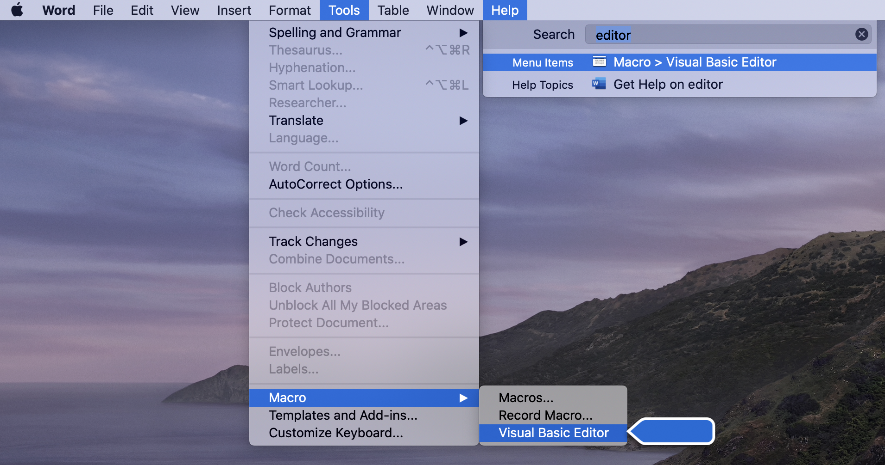
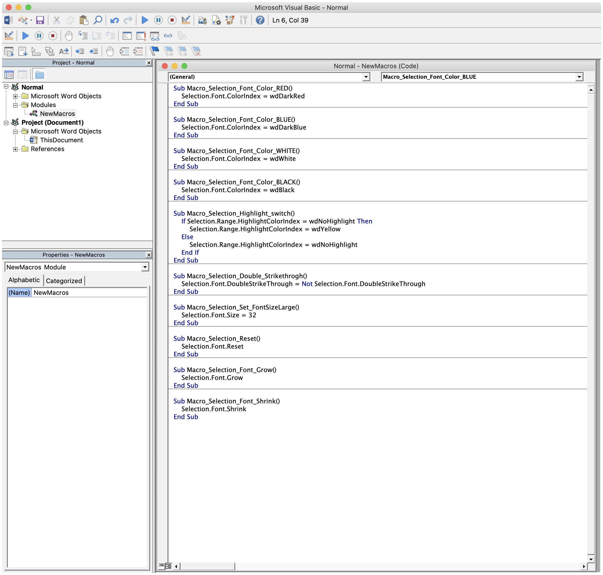
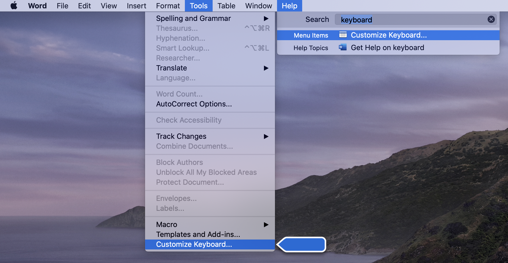
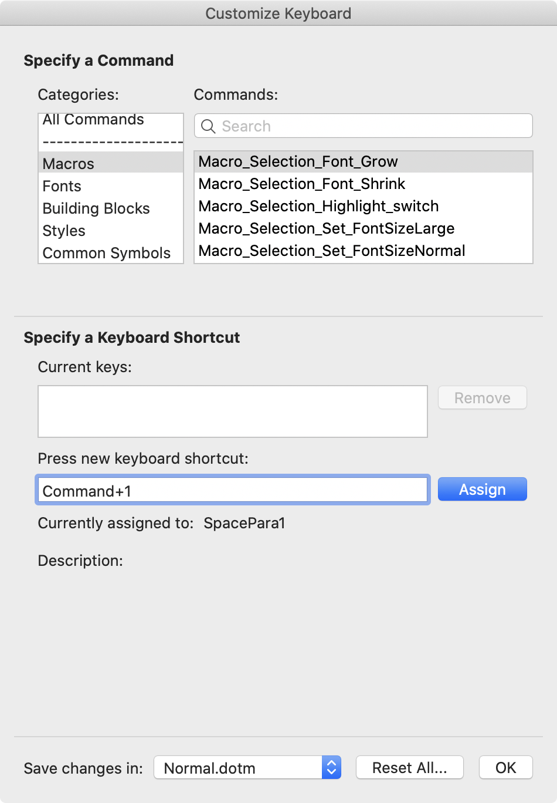
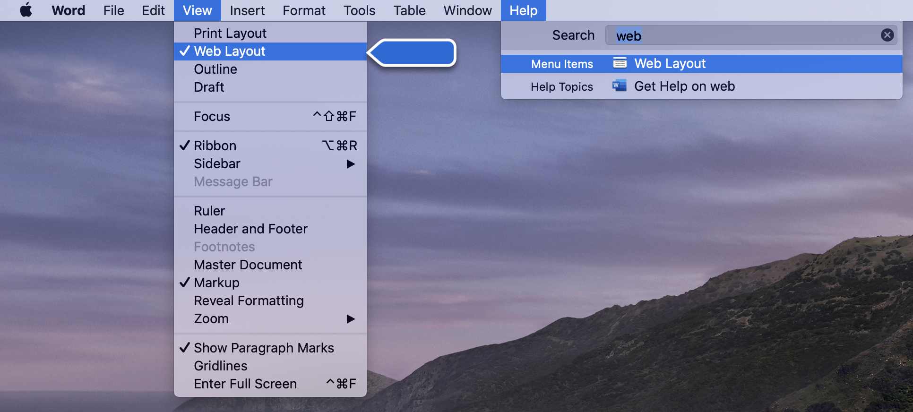
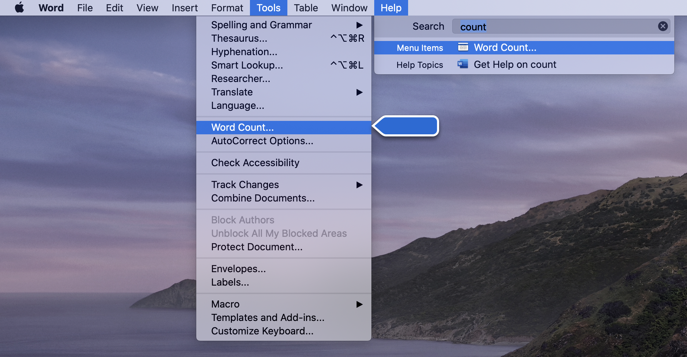
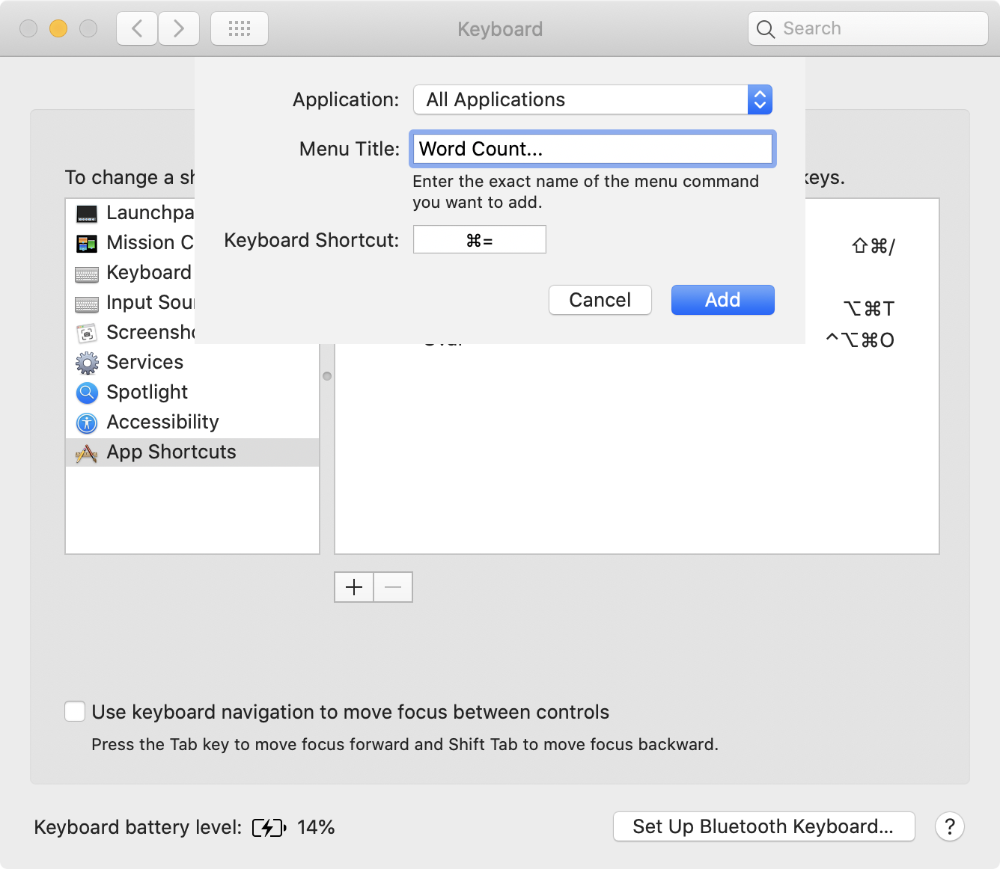

## 如何把 Microsof Word 当作白板教学工具？

在教学电子化时代，“板书” 成了令很多老师头疼的事情。

比如，板书的字不好看，写不工整…… 这其实也怪不的这一代的老师，因为这一代老师很可能干脆就用着键盘长大的，用着带有模糊音纠正的拼音输入法长大的，执笔写字不漂亮，其实非常正常。反正这一代人和上一代人不一样，没有被 “写一首漂亮字就可以给首长当秘书” 的段子忽悠过……

差不多十五年前，我在新东方教英语写作的时候，用 Microsoft Word 当作 “板书工具”，学生们见识到之后慨叹，“从来没有见过有人这么用过 Word！” —— 没想到的是，这么长的时间过去之后，“如何把 Microsof Word 当作白板教学工具？” 依然是值得分享的内容。

当年我用的 Windows 操作系统，可现在已经转到 MacOS 多年，所以以下就只演示如何在 Microsoft Word for Mac（version 16.35）中进行设置了 —— 但，无论如何，原理是一模一样的。

打开 Word，关闭所有文档，而后在 Help 菜单下的搜索框中输入 “Editor”，你会看到 “Visual Basic Editor” 菜单跳出并突出显示，直接按回车键（Enter），即能打开 Visual Basic Editor。（呼出 Help 菜单的快捷键是 `Shift + Command + /`）



在左侧上部 “Project - Normal” 面板中选择 “NewMacros”，而后在右侧 “Normal - NewMacros (Code)” 面板中输入以下代码（或者拷贝粘贴）：（[vba 文件](https://raw.githubusercontent.com/xiaolai/apple-computer-literacy/main/files/newMacro_for_NomalTemplate.vba)）

```vba

Sub Macro_Selection_Font_Color_RED()
    Selection.Font.ColorIndex = wdDarkRed
End Sub

Sub Macro_Selection_Font_Color_BLUE()
    Selection.Font.ColorIndex = wdDarkBlue
End Sub

Sub Macro_Selection_Font_Color_BLACK_WHITE_SWITCH()
    If Selection.Font.ColorIndex = wdWhite Then
        Selection.Font.ColorIndex = wdBlack
    Else
        Selection.Font.ColorIndex = wdWhite
    End If
End Sub

Sub Macro_Selection_Highlight_switch()
    If Selection.Range.HighlightColorIndex = wdNoHighlight Then
        Selection.Range.HighlightColorIndex = wdYellow
    Else
        Selection.Range.HighlightColorIndex = wdNoHighlight
    End If
End Sub

Sub Macro_Selection_Double_Strikethrogh()
    Selection.Font.DoubleStrikeThrough = Not Selection.Font.DoubleStrikeThrough
End Sub

Sub Macro_Selection_Set_FontSizeLarge()
    Selection.Font.Size = 32
End Sub

Sub Macro_Selection_Reset()
    Selection.Font.Reset
End Sub

Sub Macro_Selection_Font_Grow()
    Selection.Font.Grow
End Sub

Sub Macro_Selection_Font_Shrink()
    Selection.Font.Shrink
End Sub

Sub Macro_Selection_to_Question_Mark()
    Dim length As Integer
    Dim strTemp As String
    strTemp = ""
    length = Len(Selection.Text)
    For i = 1 To length - 1
        strTemp = strTemp + "?"
    Next i
    Selection.Delete
    Selection.InsertAfter (strTemp + " ")
    Selection.MoveRight Unit:=wdCharacter, Count:=1
End Sub
```



按快捷键 `Command + s` 保存，而后关掉 “Visual Basic Editor”。刚刚完成的是，在 “Normal” 这个模版中添加了 10 个宏。以后，你用 Normal 这个模版创建的所有文档，都自动带有这 10 个宏。在直播中，你有可能会创建新的模版（比如，希望用这个模版新建的文件大小都是定制过的），那么就需要你在新的模版里重新添加 “NewMacros” 才行。

现在，回到主菜单，再次从 “Help” 菜单的搜索框里输入 “keyboard”：



按回车键，进入 “Customize Keyboard” 对话框：



在 “Categories” 里找到 “Macros” 并点击，而后右侧的 “Commands” 列表里就能看到你刚刚在 Visual Basic Editor 里面设置的宏。然后，就可以给它们逐一设置快捷键。我的设置是这样的（`⌘` 是 Mac 上的 `Command` 键）：

| 宏名称                                        | 快捷键        | 备注                                 |
| --------------------------------------------- | ------------- | ------------------------------------ |
| Macro_Selection_Font_Grow                     | `⌘ 1` | 不断增大选中文本的字体尺寸           |
| Macro_Selection_Font_Shrink                   | `⌘ 2` | 不断减小选中文本的字体尺寸           |
| Macro_Selection_Highlight_switch              | `⌘ 3` | 选中文本在高亮与非高亮之间切换       |
| Macro_Selection_Set_FontSizeLarge             | `⌘ 4` | 将选中文本的字体大小设置为 32        |
| Macro_Selection_Font_Color_BLACK_WHITE_SWITCH | `⌘ 5` | 将选中文本颜色进行黑白切换           |
| Macro_Selection_Font_Color_BLUE               | `⌘ 6` | 将选中文本颜色设置为深蓝色           |
| Macro_Selection_Font_Color_RED                | `⌘ 7` | 将选中文本颜色设置为深红色           |
| Macro_Selection_to_Question_Mark              | `⌘ 8` | 将选中文本替换为问号字符串             |
| Macro_Selection_Double_Strikethrogh           | `⌘ 9` | 将选中文本加上双删除线               |
| Macro_Selection_Reset                         | `⌘ 0` | 将选中文本的字体恢复为默认颜色与大小 |

如此这般之后，我就可以在课堂上单手操作很多事情了（即便有时需要两只手也依然相当方便）：

> * 将一个段落中的某个重点句子（或者词汇）字体放大、加上颜色、或者高亮；
> * 在 “造句” 或者 “替换” 场景中，先把某些文本设置成 “白色”，观众看到的就是空白，而后选中那些文本，按一个快捷键，就可以将其变成黑色、蓝色、红色，或者再次变回“空白”…… 再进一步还可以加上高亮……
> * 默认情况下，Word 里对加重、倾斜、下划线，分别有快捷键 `Command + b`、`Command + i`、`Command + u`；但，并没有加上双删除线的快捷键；现在，用 `Command + 9` 即可……

以上的 10 个快捷键（宏），使得我在课堂上可以将 Word 当作非常灵活的白板使用…… 

另外一个细节是，要将 Word 的 View 设置成 “Web Layout” 才好：



再进一步，你可以研究一下 “Customize Keyboard” 对话框，值得添加快捷键的功能事实上非常多，不妨根据你自己的需要设置一下。

另外，在 MacOS 上，还有一种方式可以为 Word 设置快捷键 ——尤其为是那种 Word 默认并没有给你设置快捷键的功能，比如，“Word Count...”



打开 “System Preference.app”（点击桌面顶部工具条最左面的苹果图标，就可以找到它），依次选择 “Keyboard” > “Shortcuts”，而后在左边的列表中选中 “App Shortcuts”:


点击右边列表下面的那个 “+” 按钮，添加一个快捷键：



如此这般之后，你就可以随时用 `Command + = ` 查看 “Word Count” 了。

有了这样的设置（或者称为 “定制”）之后，作为老师的你，就会觉得 Powerpoint 相对于 Word 来看，简直弱爆了…… 不是吗？

当然，你还可以酷炫一点，比如，文档背景改成粗糙的黑色，文字颜色根据背景再改一改，再找个好看一点的手写字体，模拟黑板的样子…… 反正，工具谁都有，可善用工具的人可不多。

现在，直播平台基本上都支持 [OBS](https://obsproject.com/) 推流。在 OBS 场景布置中，放一个 “窗口捕捉”，显示 Word 窗口，即可以拥有一个相当方便的 “白板”（或 “黑板”、甚至 “绿板”）。


------
补充：

设置好的 Kyeboard Customization 和 Macro 都共同保存在 `Normal.dotm` 这个模板文件中，在 MacOS 下寻找 `Normal.dotm` 的位置：

```bash 
cd $HOME
find . -name 'Normal.dotm' 2>/dev/null
```
将这个文件做个备份，将来万一重新安装了 Word 的时候，用备份替换一下，就不用再设置一遍了。
