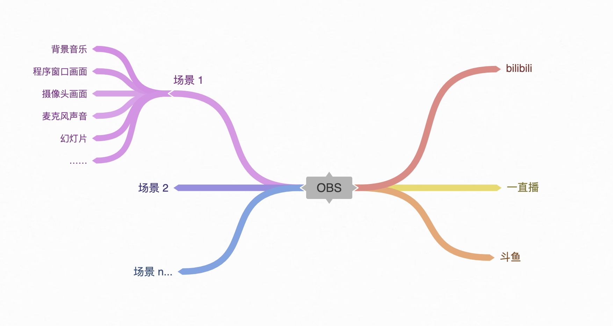
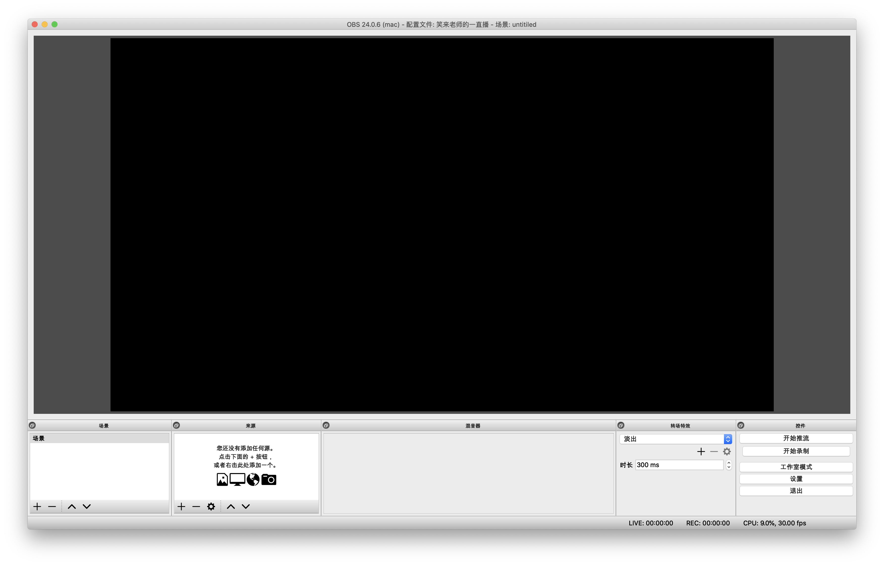
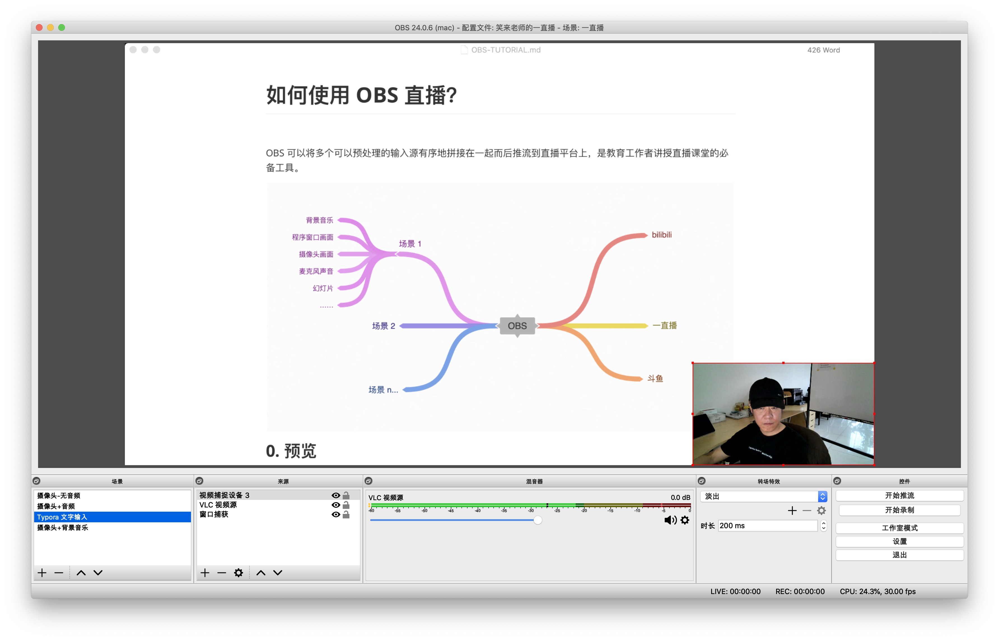
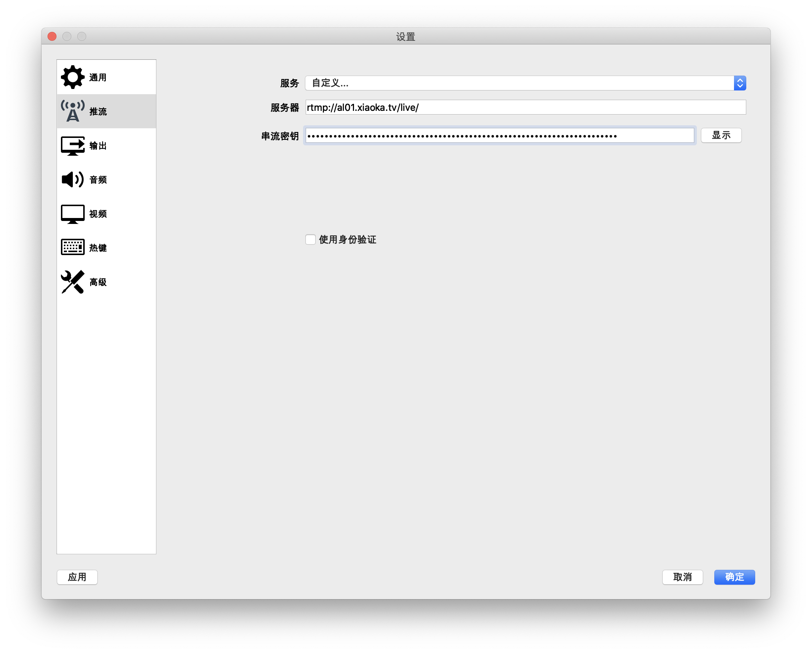
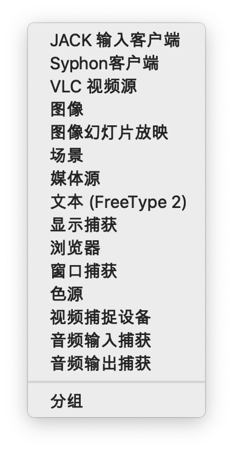

# 如何使用 OBS 直播？

[OBS](https://obsproject.com/) 可以将多个可以预处理的输入源有序地拼接在一起而后推流到直播平台上，是教育工作者讲授直播课堂的必备工具。

下载地址：

> https://obsproject.com/

## 1. 预览

打开 OBS 程序，看到的主窗口画面是这样的：

配置好之后的窗口大概是这样的：

同时按下 `command` 键和 `,` 键，呼出 “Preference” 窗口，在“推流”中设置好服务器和串流密钥（这些参数，要在直播平台生成直播后获得）：

如此这般之后，就可以开始直播了……

## 2. 场景设置

所谓场景，就是一组输入源的组合，输入源包括以下类型：

你可以根据需求创建多个场景，并且在直播过程中根据需求随时切换场景。

比如，可以设置一个场景，命名为 “开场白” —— 因为自己准备开播需要一定的时间，人家进入直播间也需要一定的时间，所以，就可以用以下输入源拼接成一个场景：

> * 图像
> * 媒体源

这样的话，人们进入直播间，虽然目前尚未开始直播，但可以看到一张海报的同时能够听到背景音乐……

而讲课的时候，若是需要一个书写功能，那么就可以设置一个“板书显示”场景：

> * 窗口捕获
> * 音频捕捉设备

这样的话，当老师切换到这个场景的时候，观众看到的是那个程序窗口（文字输入的时候，我所使用的是 Typora 这个 Markdown 编辑器），以及老师正在讲话的声音。

如果你想要让观众同时看到摄像头面前的你，那么，在以上场景中再添加一个输入源，“视频捕捉设备”，并且可以在预览屏幕上直接调整显示大小：

> * 窗口捕获
> * 音频捕捉设备
> * 视频捕捉设备

需要注意的是，“来源”面板里的输入源，是有先后顺序的。处于最顶端的来源，放在最前面，依次层叠。

## 3. 需要注意的地方

主要有两个需要注意的地方。

第一个是新手不经提醒就一定会掉进去的坑：

> 在直播的时候，电脑的声音输出要静音 —— 否则，直播中会出现无限循环的回音……

另外一个需要注意的是，从电脑上直播的时候，观众从手机上，只能看到上半屏在直播，可以通过横放手机达到全凭效果；自定义分辨率不一定会成功，因为每个直播平台的处理方式不一样。

## 4. 一直播直播操作步骤

* 登录网页版 yizhibo.com （注意，最好使用微博登录；这么做的另外一个麻烦就是，你发起直播的时候，微博上就会自动发一条消息）
* 点击“直播管理”，发起直播。
* 配置 OBS 的串流密钥
* 而后在互动生成页面，选择“先审后发”，点 “生成互动模块” 按钮。
* 在 OBS 上 “开始推流”。

## 技巧：

1. 可以使用按住 ALT 键，crop（剪裁视频源）

https://obsproject.com/forum/threads/camera-size.4585/

2. 窗口捕捉，如果看不到已有窗口列表，那么，System Preference > Security & Privacy > Screen Recording 里面，OBS.app 之前需要打勾。如果 Screen Recording 右侧的列表为空，那么，需要现在 OBS 中，添加一个 Display Capture，会有一个对话框跳出来，让你在 System Preferernce 里面勾选。

### 待补充

快捷键设置：语音输入一键静音很必要

讲课用来消回音的输入设备，最好的，其实是苹果的 airpod 耳机（不是 pro）

用 iPad 做展示板是最好的选择；Reflector3；DemoPro

在 iPad 上，什么都可以做，Prezi/Keynotes/Powerpoint/Paper....

“prezi，讲 iPhone 作为遥控器” —— Prezi 是“窗口播放”，而不是全屏播放，这点，比 powerpoint、keynotes 更好；Prezi 中文字体问题，解决方案是，用 sketch，直接将文字导出为透明背景的 png，导入 Prezi。

摄像头的位置；

绿幕的使用方法；

