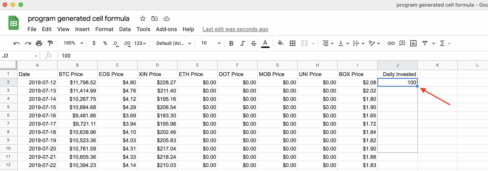
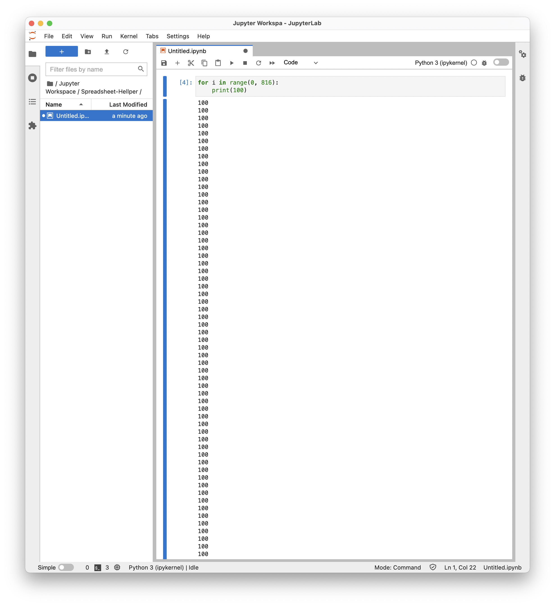
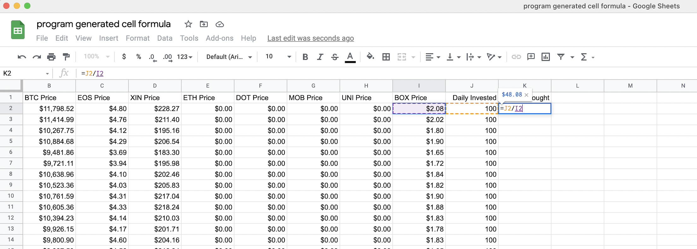
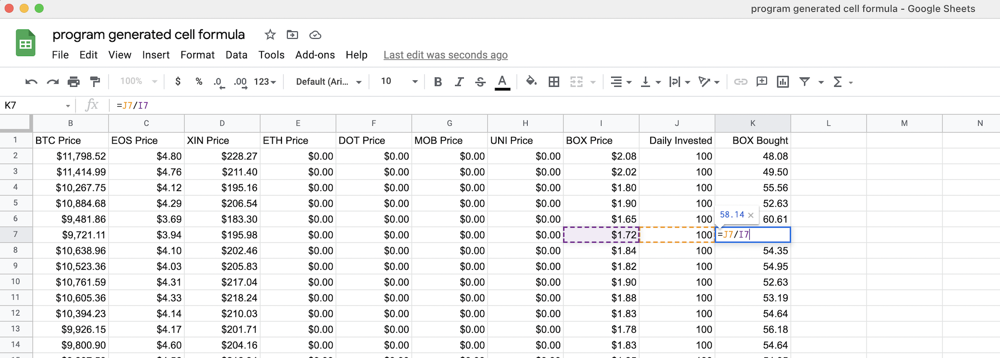
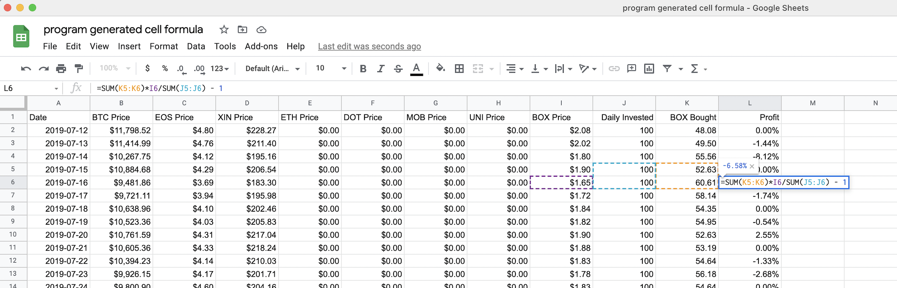
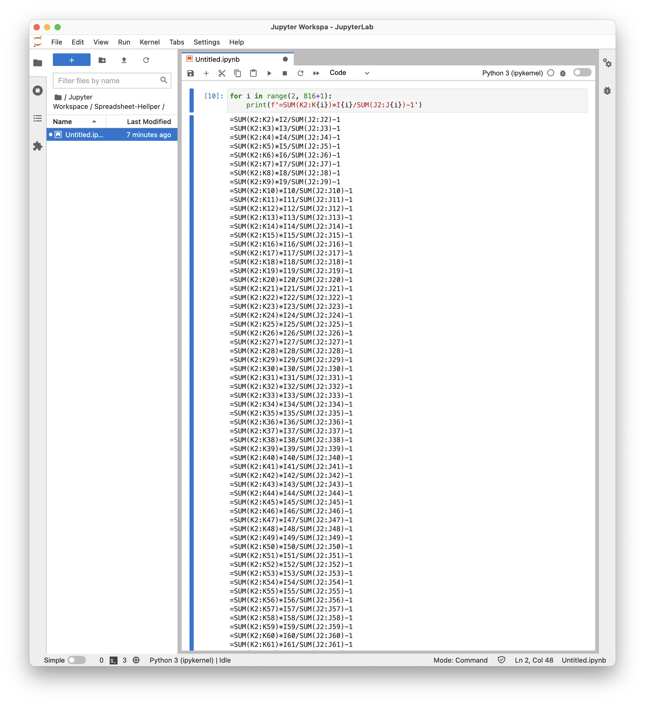

# 用程序批量填充单元格公示

我现在很少打开 Microsoft Excel 和 Apple Numbers 了，因为它们已经被 Google Spreadsheets 替代。

这些电子表格都一样，提供「自动填充单元格」的功能。



比如，在上图中，我点击 `J2` 单元格，然后，`J2` 的蓝色边框的右下角有一个方点 —— 我用鼠标点中那个方点，往下拖，那么，在我用鼠标拖出来的范围内，都用 `J2` 单元格的内容填充……

—— 可问题在于，若是我需要填充的单元格多达几百个，甚至更多，鼠标拖拽就很费劲了……

有程序帮忙就方便了。用 Python 写两行代码，就可以很方便地生成无论多少行，比如，我需要 816 行：

```python
for i in range(0, 816):
    print(100)
```

将输出结果拷贝粘贴到电子表格里就行了…… 我用 [Jupyterlab](jupyter.md) 是这样的：



批量生成公式也很简单……



```python
for i in range(2, 816+1):
    print(f'=J{i}/I{i}')
```

虽然你可能看不懂程序，但，你可以盯着看一下，把这段代码当作「模版」，然后，根据自己的需求改一改…… 比如，你需要的是 `1056` 行，那你就把上面代码中的 `816` 改成 1056 `就`可以了……

然后拷贝粘贴，几百个单元格就填充完了：



现在，想要算每天的收益率，那就是把 `J` 列的数字合计，就是「累计投资额」，把 `K` 列合计就是当前「累计购买数量」，再乘以 `I` 列的对应价格，就是「当前资产净值」…… 

> 收益率 = 累计购买数量 x 当前价格 /  累计投资额 - 1

于是，前几行单元格里填充 的公式大概是这样：

```json
=SUM(K2:K2)*I2/SUM(J2:J2)-1
=SUM(K2:K3)*I3/SUM(J2:J3)-1
=SUM(K2:K4)*I4/SUM(J2:J4)-1
=SUM(K2:K5)*I5/SUM(J2:J5)-1
=SUM(K2:K6)*I6/SUM(J2:J6)-1
=SUM(K2:K7)*I7/SUM(J2:J7)-1
=SUM(K2:K8)*I8/SUM(J2:J8)-1
=SUM(K2:K9)*I9/SUM(J2:J9)-1
```

这样的时候，你就会沮丧地发现，要填充几百个单元格竟然是「**不可能的**」！—— 因为当你正确写完第一个单元格之后，Spreadsheet 自作聪明地把它替换成了 `=SUM(K2)*I2/SUM(J2)-1`……

然后，就算你把前三行都填充进去，然后，选中这三行，用鼠标拖拽那个方点，你会发现 Spreadsheet 的「自动」完全是乱七八糟的……



Google Spreadsheet 的自动填充（其他的电子表格都一样），只能完成最基本的操作；一旦需要多一点的变量，它就没办法帮你「自动」了……

—— 也就是说，**你不写程序帮你自己的话，这么简单且常用的事儿，你自己竟然无能为力！**

可，用 Python，还是两行就够：

```python
for i in range(2, 817+1):
    print(f'=SUM(K2:K{i})*I{i}/SUM(J2:J{i})-1')
```

> 观察一下，这次是从 `2` 开始的，所以，到 `817 + 1` 结束，而不是 `816 + 1`……

然后就瞬间生成了：



拷贝粘贴进去，就完事儿了 —— 这竟然是一个真的拦路虎！到底能拦住多大比例的人群我们无从而知，但，反正过去肯定能拦住你。

也就是说，无论多复杂的公式，你调整一下以上两行 Python 程序的「模版」，反正到最后都能弄出来……

以上的示例表格，可通过这个链接访问：

> [示例表格](https://docs.google.com/spreadsheets/d/1bWtV-J5J4U177DHsa6BtqGdTAGcm7Iy6iOFupW3A3n0/edit?usp=sharing)

