# 从 Terminal 开始……

注：我现在用的是基于 Apple Silicon 芯片的 Mac，Homebrew 的安装目录，在基于 Intel Chip 的 Mac 上可能有所不同。Homebrew 的根目录到底是什么，可以用 `echo $(brew --prefix) ` 查看。

## 0. Language

系统语言要设置成英文。这样的好处在于，将来你遇到任何问题的时候，出错信息里里外外全都是英文的，于是，就可以直接拷贝粘贴到 Google 里搜索解决方案。不然的话，各种名称都可能因为是中文的而找不到太好的解决方案…… 另外，Region 也干脆设置成 `United States` 算了，因为将来可能还需要用海外账号使用 TV App，和 News App……

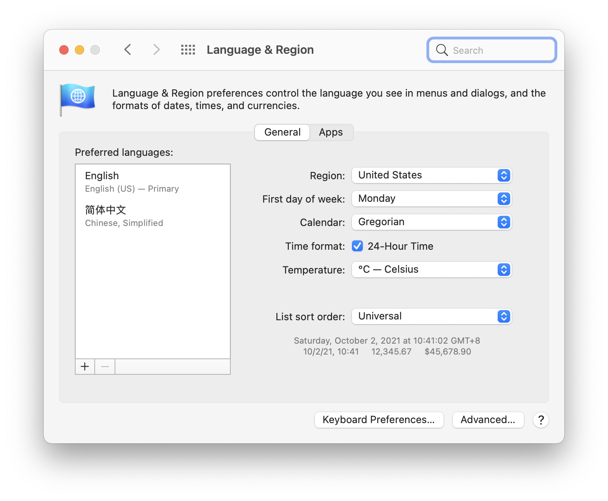

## 1. Terminal

打开一个新的 Mac（iMac、Macbook 等等），即便你是新手，要第一个使用的，就是 Terminal 程序。

在新的 Mac 上打开 Terminal 程序的方法有以下几个：

> * 先点击 Dock 上的 Launchpad 图标  ，而后在搜索框里输入 `Terminal`，随后通过点击打开。
> * 在 Finder  程序里  ，打开 `/Applications/Utilities` 文件夹，双击里面的 Terminal 程序图标。
> * 使用快捷键 `⌘ + Space` 呼出 Spotlight，输入 `Terminal` 而后按 `⏎` 键，即，Return 键。

在 Spotlight 里输入 `ter` 这三个字母的时候，Terminal 已经排在第一位了，这时按下  `⏎` 键，即，Return 键，就可以打开 Terminal 程序。

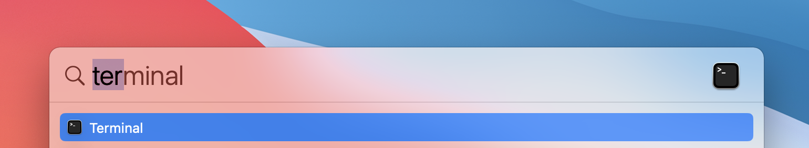

我第一次打开 Terminal 的时候是这样的：

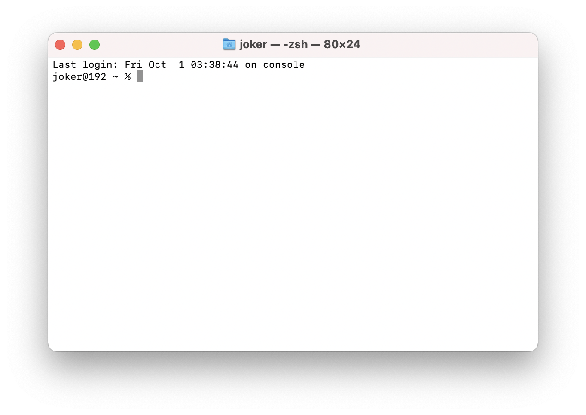

## 2. Xcode Command Line Tools

在 Terminal 中执行以下命令（或者手动输入进去，或者拷贝粘贴，而后按 `⏎` 键，即，Return 键）：

```bash
xcode-select --install
```

而后会跳出一个消息窗口，按提示一步一步做即可 —— 根据你的网速，需要等一段时间才能够完成。

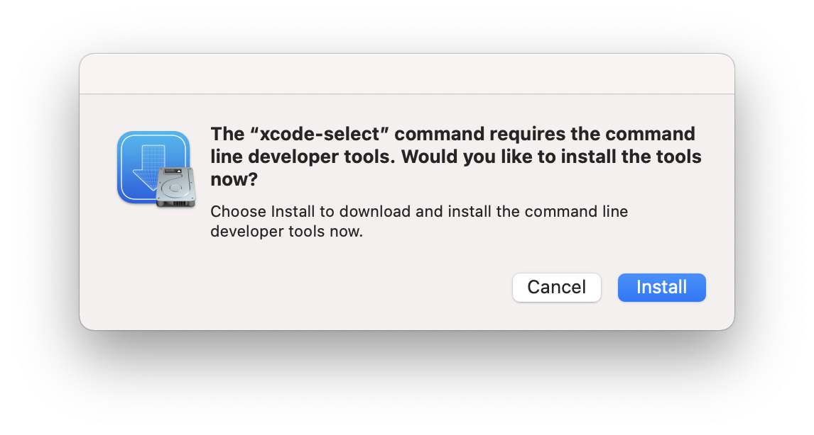

这一步安装，从你的角度来看，好像没发生什么…… 

## 3. Oh-my-zsh

在 BigSur 里，Mac OS 使用的默认 Shell，不再是 `bash`，而是 `zsh`，所以，干脆再安装一个 `zsh` 的增强工具，`oh-my-zsh` —— 它将来会提供很多方便：

```bash
sh -c "$(curl -fsSL https://raw.github.com/ohmyzsh/ohmyzsh/master/tools/install.sh)"
```

这个脚本程序完成之后，需要再执行一条命令：

```bash
echo 'eval $(/opt/homebrew/bin/brew shellenv)' >> $HOME/.zprofile
```

然后，执行 zsh 的重新启动命令 —— 记住这个命令，因为你后面会经常需要「重新启动 zsh」（`exec` 是英文单词，即，「执行」， `execute` 的简写）：

```bash
exec zsh
```

然后，Terminal 的提示符会看起来有所不同

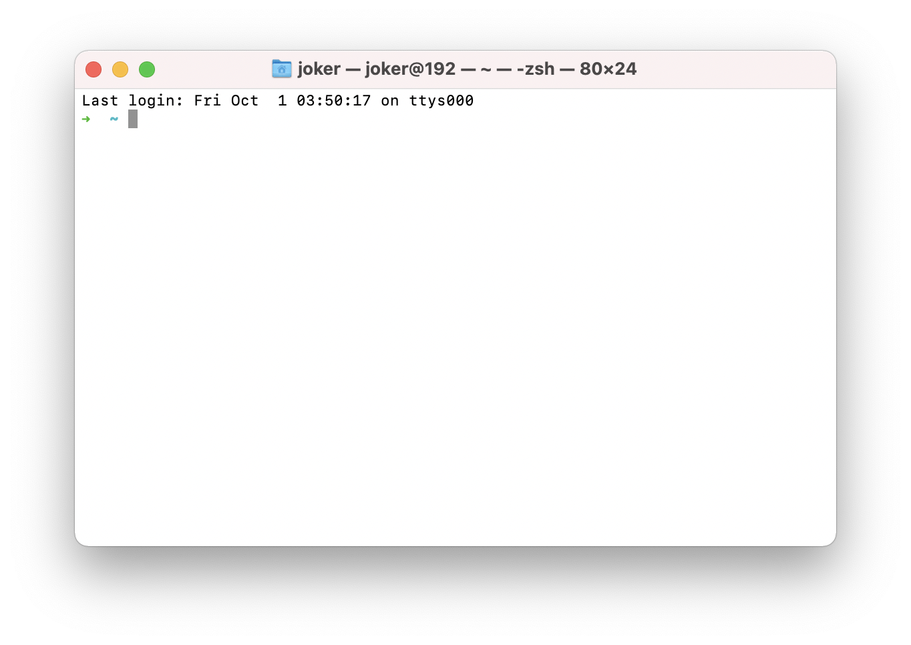

等一会儿安装好 Homebrew 之后，我们还可以进一步美化一下 Terminal 以及命令行提示符……

## 4. Homebrew

以后大量的程序安装、升级、卸载，都靠 [Homebrew](https://brew.sh/) 。

使用同一个工具管理所有软件的下载安装，当然远比一个个打开网站手动下载再安装方便太多了。

但，用 Homebrew 最直接的好处就是，用它可以绕开 GFW，直接下载并安装必要的 VPN 软件，免费的比如 Shadowsocks、ClashX，收费的比如 Surge 等等 —— 没有 Homebrew，你就被限制住了：没有 VPN 软件，所以，无法打开 Google，也无法连接到下载 VPN 软件的网站上，然后，死循环。

Homebrew 官方的代码仓库保存在 [GitHub](http://github.com/) 上，在国内很多地方，直接访问 Github 要么直接访问不了，要么非常非常慢…… 所以，安装 Homebrew 的时候，需要「绕行」一下，先用国内镜像安装，然后再切换回官方源。

将以下代码拷贝粘贴到 Terminal 里，而后，按 `⏎` 键，即，Return 键：

```bash
# 使用国内源安装
/bin/zsh -c "$(curl -fsSL https://gitee.com/cunkai/HomebrewCN/raw/master/Homebrew.sh)"
```

第一步选择镜像。我在北京，所以，就输入了 `2`，即，选择了清华大学下载源；随后，输入 `y`  确认开始执行脚本；之后会要求输入 password…… 这个 password 就是你的「开屏密码」（就是打开电脑，或者待机之后重新开机，需要登录的时候，所需要输入的那个密码）—— 在输入密码的时候，你在 Terminal 里看不到之前在图形界面中你所熟悉的对应的星号 `*****`，正确输入之后，按 `⏎` 键即可。如果输入错误，那就多按几次 `delete` 键，确保彻底删除所有已输入字符，重新输入即可。

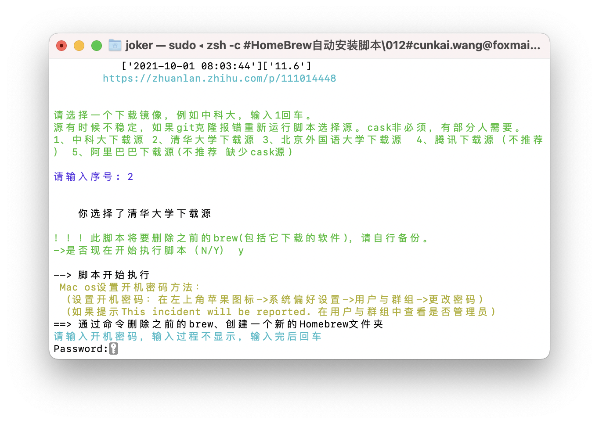

这个安装脚本会在 `.zprofile` 文件里补上一行：`eval $(/opt/homebrew/bin/brew shellenv)`，你暂时忽略这个细节，在命令行里重新启动 zsh 即可：

```bash
exec zsh
```

而后，可以用以下命令验证 Homebrew 的安装：

```bash
which brew
brew update
brew doctor
```

实际上，`brew` 的常用命令也没几个，先放在这里，回头再来逐个试几遍……

```bash
brew -v
brew list
brew doctor
brew update
brew upgrade 
brew search
brew info
brew cleanup
```

## 5. VPN Clients

MacOS 上可用的 VPN 客户端，免费的有 Shadowsocks 和 ClashX，收费的有 Surge，都可以通过 `brew` 命令安装。

```bash
brew install shadowsocksx-ng-r
brew install clashx
brew install surge
```

使用 `brew` 命令安装的第三方程序，在系统默认的情况下，会触发警告，比如这样的：

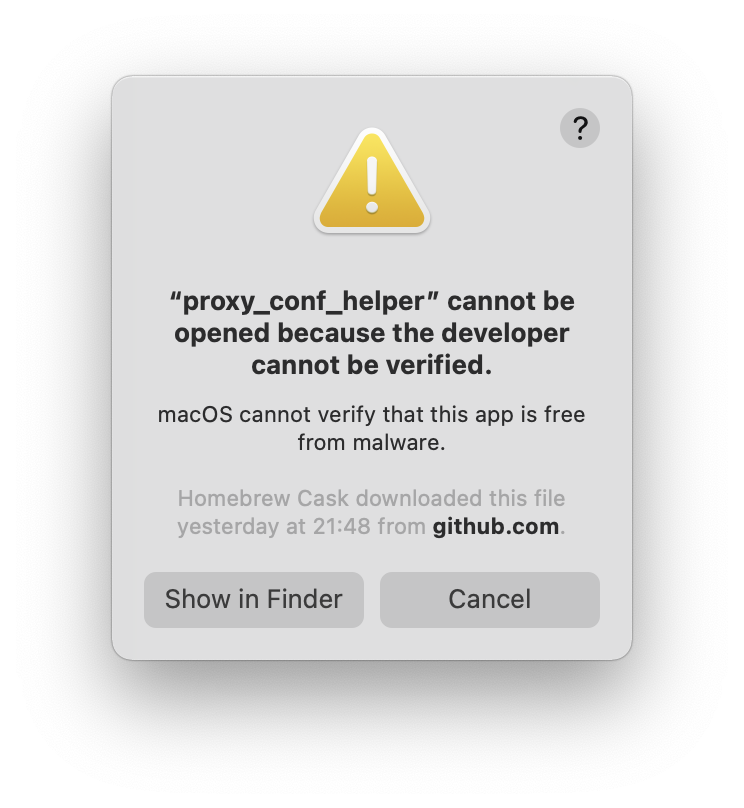需要于是，需要你在 System Preferences 里设置一下，在 `Allow apps downloaded from:` 之下，选择 `App Store and identified developers` ，然后，按那个 `Allow Anywa` 按钮：


## 6. Homebrew (2)

如果你已经购买过 VPN 服务，并且能用以上三个 VPN 程序中的某一个设置好，那么，你应该能够顺畅地连接「外网」了，那么你现在可以把 homebrew 的「源」切换回官方源了 —— 将以下代码拷贝粘贴到 Terminal 里执行：

```bash
# 恢复官方源
cd "$(brew --repo)"
git remote set-url origin https://github.com/Homebrew/brew.git
cd "$(brew --repo)/Library/Taps/homebrew/homebrew-core"
git remote set-url origin https://github.com/Homebrew/homebrew-core.git
cd "$(brew --repo)/Library/Taps/homebrew/homebrew-cask"
git remote set-url origin  git://github.com/Homebrew/homebrew-cask.git
# 更新至最新
brew update
# 检查 Homebrew 状态
brew doctor
```

## 7. Terminal (2)

现在，可以「装修」一下 Terminal 了。

先安装一个字体

```bash
brew tap homebrew/cask-fonts
brew install --cask font-sauce-code-pro-nerd-font
```

设置 Terminal 的字体（目前使用的 Profile 是 Basic）—— 在 Terminal 处于当前焦点的情况下，按快捷键 `⌘ + ,` 呼出 Terminal 的 Preferences 窗口，而后，在 Profiles 标签里，点击左边栏的 `Basic`，而后，在右侧 `Text` 标签页里设置 `Font`

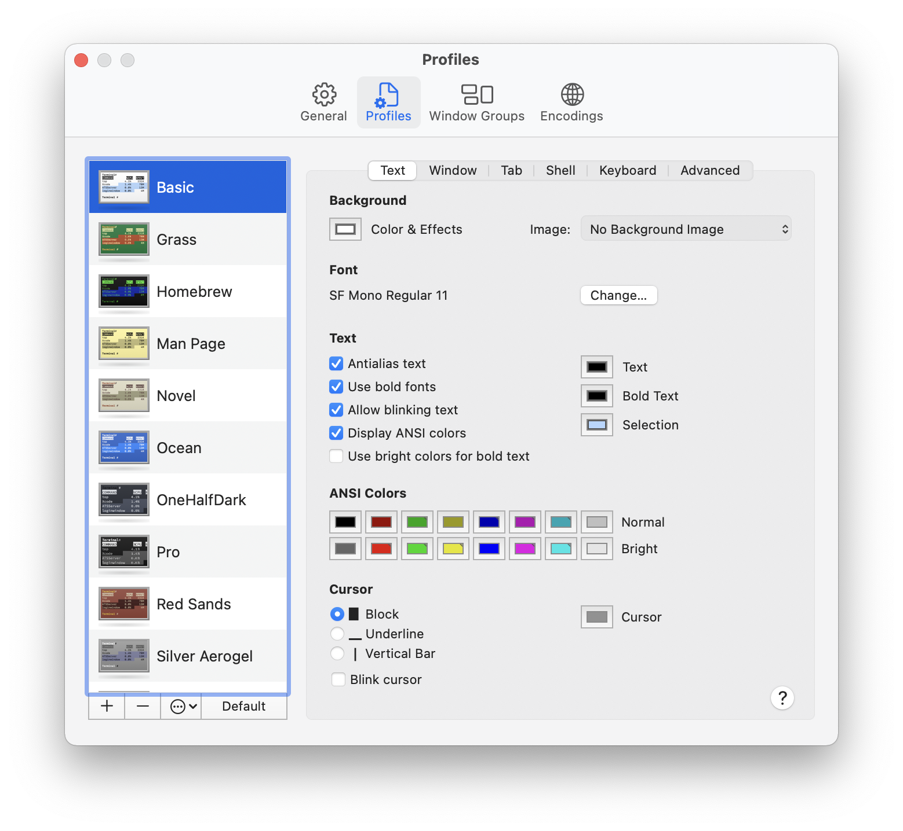

在右边的 `Font` 区域，点击 `Change` 按钮后，字体设置窗口里只有一个下拉菜单设置字体大小：

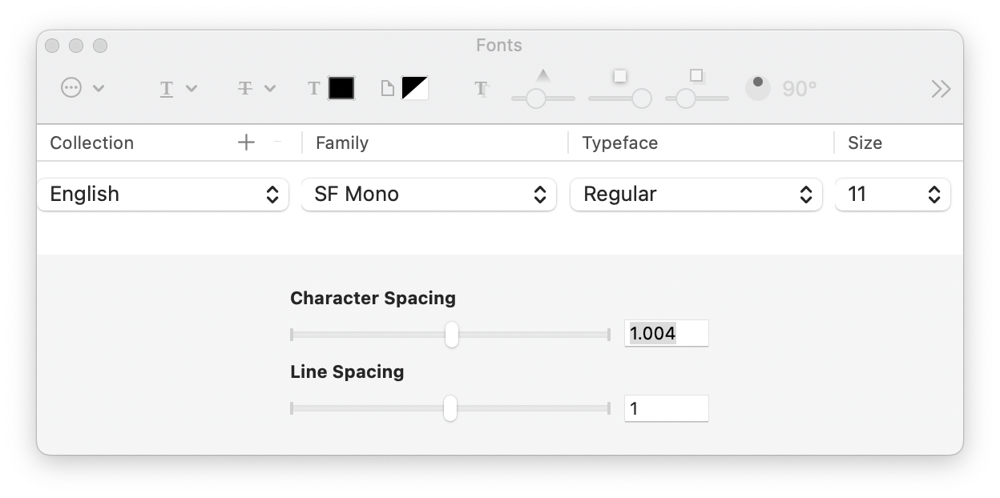

但是，如果你把窗口拉长，就可以直接输入字体大小了，比如，我经常用的是 `15` —— 在下拉菜单里就没有这个设置。下图中，我已经把字体换成了 `SauceCodePro Nerd Font Mono`，Typeface 选择了 `ExtraLight`……


**注意**：一定要把字体设置 `Sauce Code Pro Nerd Font Mono`，这就是之前我们用 `brew` 命令新安装的字体。

在 Window 标签里，可以设置窗口大小（也就是一屏显示多少行，每行多少个字符），我一般是设置成 `120 x 32`，你自己看着办：

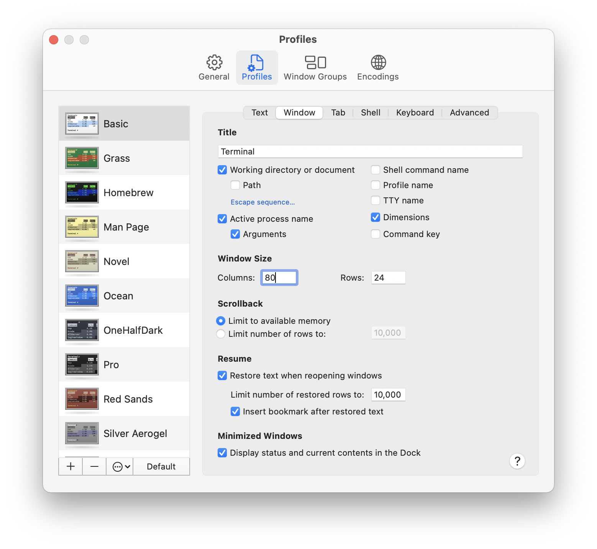

现在，再安装 Terminal 的 [Powerlevel10K Theme](https://github.com/romkatv/powerlevel10k) for zsh：

```bash
git clone --depth=1 https://github.com/romkatv/powerlevel10k.git ${ZSH_CUSTOM:-$HOME/.oh-my-zsh/custom}/themes/powerlevel10k

# 中国大陆用户没有 VPN 的情况下，可以用 gitee.com 上的镜像
# git clone --depth=1 https://gitee.com/romkatv/powerlevel10k.git ${ZSH_CUSTOM:-$HOME/.oh-my-zsh/custom}/themes/powerlevel10k
```

为了随后的方便，再安装一个文本编辑器（免费，但也可以缴费注册）

```bash
brew install sublime-text
```

如此这般安装好 sublime-text 之后，在 Terminal 里，随时可以使用 `subl` 命令编辑任何文本文件。

现在使用 sublime-text 编辑 `~/.zshrc` 文件，在 Terminal 里输入

```bash
subl ~/.zshrc
```

在 `~/.zshrc` 这个文件里，已经有很多内容（都是之前安装 Oh-My-Zsh）的时候生成的。在里面找到有 `ZSH_THEME=...` 的哪一行，将它改成：

```bash
ZSH_THEME="powerlevel10k/powerlevel10k
```

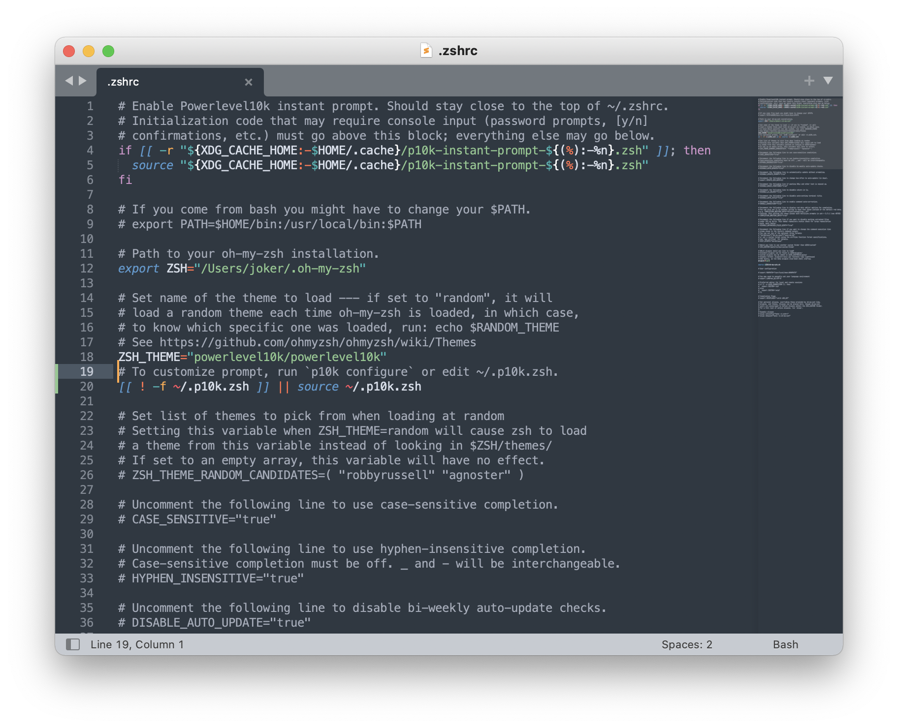

而后重新启动 zsh（`exec zsh`），执行以下命令，以配置 Powerlevel10K：

```bash
p10k configure
```

按照提示一步一步选择即可。可以多试几次，不满意，就重新设置一遍。

另外，我比较喜欢 [SpaceGray](https://github.com/wtanna/Spacegray-OSX-Terminal-Theme) 这个 Terminal Theme。（事实上，你可以在网上找到很多 Terminal Theme for Mac OSX……）

```bash
cd ~
curl https://raw.githubusercontent.com/wtanna/Spacegray-OSX-Terminal-Theme/master/spacegray.terminal --output spacegray.terminal
open spacegray.terminal
```

然后，一个新的 Terminal 窗口会被打开。接着用快捷键 `⌘ + ,`，呼出 Preferences 窗口，而后，在 Profiles 标签里，点击左边栏的 `SpaceGray`，而后，在右侧 `Text` 标签页里设置 `Font`，`Windows` 标签里设置窗口大小…… 而后，再将 `SpaceGray` 设置为 `Default`。

设置完之后，可以把刚才下载的 `spacegray.terminal` 文件删掉：

```bash
cd ~
rm spacegray.terminal
```

而后， Terminal 就被「装修」成了这个样子：

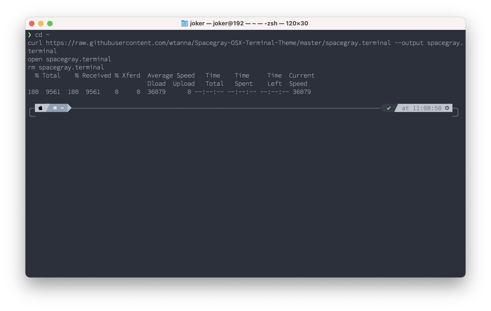


这个 Terminal 的标题栏上，标识是 `joker@192`，这里的 `192` 是目前系统的 `hostname`，而 `192` 是我当前使用电脑的内网 IP 地址中最没用的第一段（总计四段），没有任何意义…… 所以，我可以用以下命令设置当前计算机的`hostname`：

```bash
scutil --set HostName "Macbook-Air-M1"
```

而后重新启动 zsh：

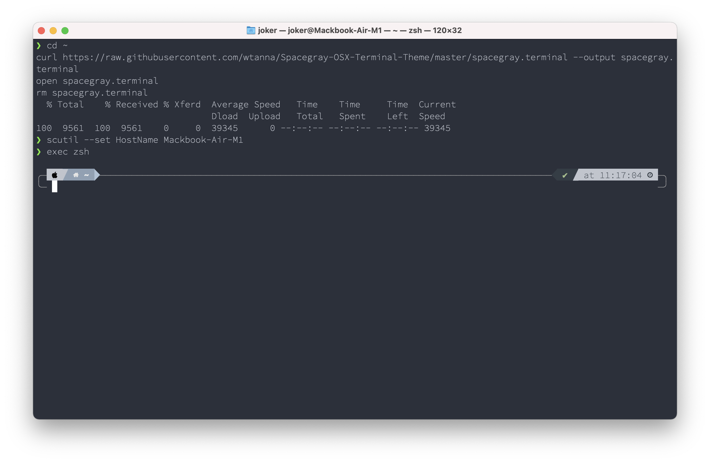

## 8. Softwares

第三方的程序，绝大多数都可以通过 `brew` 命令下载、安装、升级（我自己用的程序里，目前只有 Mixin Desktop 不能通过 `brew` 命令安装）—— 甚至，用 `brew` 命令还能安装一个 `mas` 用来管理 App Store 里的程序…… 而后，我可以用一行命令升级所有程序 `brew update && brew upgrade && mas upgrade` —— 当然，这条命令，你得等会儿才可以使用。

### 8.1 基本 Shell 工具

```bash
brew install git	# MacOS 自带的 Apple Git 也不是不能用，但，替换掉已经成了习惯
brew install wget	# 比 curl 方便一点的下载工具
brew install tree	# 用来查询目录的树状结构
brew install mas	# 用来管理 App Store 里的软件
```

### 8.2 系统维护工具

```bash
brew install appcleaner	# 图形化的软件卸载工具
brew install onyx	# 系统维护工具，比如清理系统垃圾
brew install cleanmymac	# 系统维护工具，功能比 onyx 多一点点，收费软件
```

### 8.3 系统增强工具

```bash
brew install bettertouchtool	# 定制各种快捷操作，也能做窗口管理
brew install alfred	# 定制各种工具流，还包括一个剪贴板增强工具
brew install blackhole-64	# 系统音频软导流工具，用 OBS 做直播播放音乐时需要
```

### 8.4 文本编辑器

```bash
brew install sublime-text	# 轻量级、速度快、功能丰富的纯文本编辑器
brew install visual-studio-code # 微软出品的代码编辑器（基于 Google Atom）
brew install typora	# MacOS 上最好最方便的 Markdown 编辑器
```

### 8.5 各种浏览器

```bash
brew install google-chrome
brew install firefox
brew install microsoft-edge
brew install brave-browser
brew install opera tor-browser	# 自带翻墙软件 tor，缺点是速度慢
```

### 8.6 代理服务器客户端

```bash
brew install shadowsocksx-ng-r	# 支持订阅的 shadowsocks 客户端
brew install clashx	# 另外一个代理服务器客户端（我没咋用过）
brew install surge	# 收费的代理服务器客户端，还可以单独装在一台电脑上做局域网的网管
```

### 8.7 更多第三方软件

事实上，很多在 App Store 里能下载的软件，`brew` 里面也有，比如 Wechat 桌面版，比如微软的 Remote Desktop…… 只要是能用 `brew` 下载安装的，就全都用 `brew` —— 无非是在安装之前，先去用 `brew search <softwarename>` 搜索一下，看看能不能找到；找到之后，再用 `brew info <software name>` 确认一下……

```
brew install android-studio	# 安卓模拟器，我用它在 MacOS 使用 Kindle 听读有声书
brew install audacity	# 音频编辑器
brew install baidunetdisk	# 百度网盘
brew install calibre	# 电子书管理用具，我经常用它做一些电子书的格式转换
brew install dropbox	# 云存储
brew install keka	# 解压缩用具
brew install microsoft-remote-desktop	# 远程桌面管理（比如，登录局域网内的某台 Windows 设备）
brew install miniconda	# conda 极简版，我平时用 Jupyter lab 比较多
brew install obs	# 直播推流软件，也可以用来录屏
brew install openaudible	# 将 Audible 的文件转换成 mp3,收费软件
brew install sketch	# 矢量图编辑工具，收费软件
brew install skitch	# 印象笔记出品的一个截屏软件，比系统自带的功能更全一些
brew install spotify	# 音乐软件，收费软件
brew install thunder	# 迅雷下载工具
brew install transmission	# 另一款 bittorrent 下载客户端
brew install vlc	# 媒体播放器
brew install webcatalog	# 将很多网站服务打包成 App 独立运行的软件，我用它下载 Google Sheets 之类
brew install wechat # 微信桌面版
```

### 8.8 用 mas 管理 App Store

尚未安装 `mas` 的话，用 `brew install mas` 安装。`mas` 命令的用法如下：

```bash
mas list		# 列出 App Store 中已安装的软件
mas upgrade	# 升级所有 App Store 中的软件
mas search	# 搜索某软件的安装 ID
mas install <software id>	# 安装某软件
```

在新电脑上，我用以下命令安装所有我需要在 App Store 中安装的软件：

```bash
mas install 1333542190	## 1Password 7	密码管理软件
mas install 1569813296	## 1Password for Safari	
mas install 438292371		## Amadeus Pro	音频编辑软件，收费
mas install 1487937127	## Craft	笔记管理软件，MacOS、iOS 通用，收费
mas install 409222199 	## Cyberduck	可用 brew 安装，sftp 软件，但，我在 App Store 里付费了
mas install 553245401 	## Friendly Streaming	收费视频平台聚合，我用它在电脑上看 Netflix 什么的
mas install 682658836		## GarageBand	苹果的音乐工作室
mas install 1461845568	## Gifox	录屏软件，保存为 gif 动图
mas install 1474276998	## HP Smart	惠普打印机管理
mas install 408981434		## iMovie	
mas install 1136220934	## Infuse	我用它来播放局域网内的视频
mas install 409183694		## Keynote	
mas install 1295203466	## Microsoft Remote Desktop
mas install 462054704		## Microsoft Word
mas install 409203825		## Numbers
mas install 409201541		## Pages
mas install 485812721		## TweetDeck	Twitter 的桌面客户端，可多栏显示
mas install 970502923		## Typeeto	可用电脑键盘为 iOS 输入
mas install 497799835 	## Xcode	
```

如此这般之后，我就可以用 `brew update && brew upgrade && mas upgrade` 这一行命令升级电脑里的所有软件了……

## 9. Massed up

在整个操作过程中，有可能「不小心搞乱了」，那就重来一遍，无所谓的。卸载 Homebrew 的脚本如下 —— 至于两个脚本里用哪个，要看你正在使用的是哪个源：

```bash
# 使用官方源
/bin/bash -c "$(curl -fsSL https://raw.githubusercontent.com/Homebrew/install/HEAD/uninstall.sh)"

# 使用国内镜像
/bin/zsh -c "$(curl -fsSL https://gitee.com/cunkai/HomebrewCN/raw/master/HomebrewUninstall.sh)"
```

然后再在 Terminal 里删除整个 Homebrew 的目录：

```
sudo rm -rf /opt/Homebrew
```

