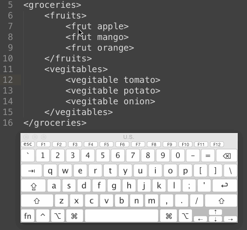

# Sublime Text

一个称手的纯文本编辑器，是必需的。Sublime Text 看起来挺贵的，$99 —— 但用得多了就值了。不缴费也能继续使用，只不过会被经常提醒缴费而已。

```
brew install sublime-text
```

用 Homebrew 安装 Sublime Text 之后，命令行里会多一个命令，`subl`。

任何人（哪怕不是程序员）都一样，经常需要

> * 搜索与替换，或者批量替换
> * 调整段落或者行的顺序，或者排序
> * —— **还有无数因为你不知道所以才不需要的细节……**

以下是一个用 Sublime Text 多行同时操作的演示：



更多的功能，不妨去查看以下别人的教程：

> * [GETTING STARTED WITH SUBLIME TEXT: 25 TIPS, TRICKS, AND SHORTCUTS]([Sublime Text 3 Tips and Tricks | General Assembly](https://generalassemb.ly/blog/sublime-text-3-tips-tricks-shortcuts/))
> * [Sublime Text GIFS Cheat Sheet](https://www.shortcutfoo.com/blog/sublime-text-3-gifs-cheat-sheet/)

当然，任何人最终为了（极大）提高效率，都会（也都有可能）学一点编程的 —— 明明花同样的钱买了一个自动化工具（就是电脑），会不会写程序所带来的效率差异，而不是一倍两倍，有可能万倍千万倍都不止呢。

