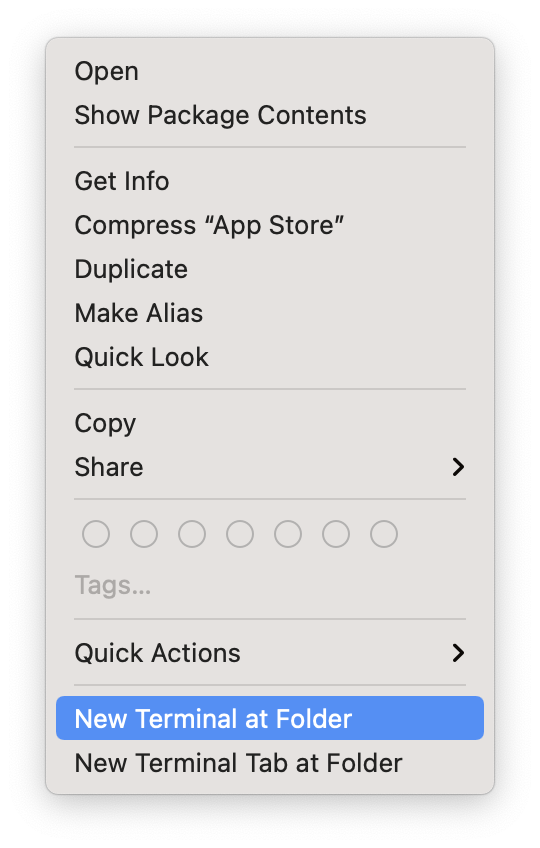
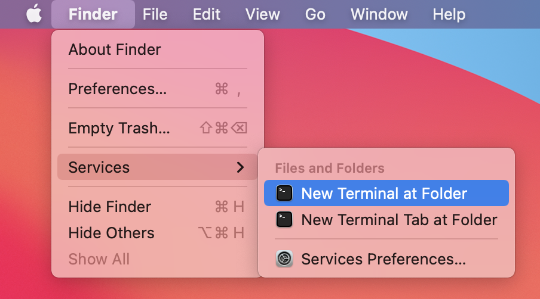
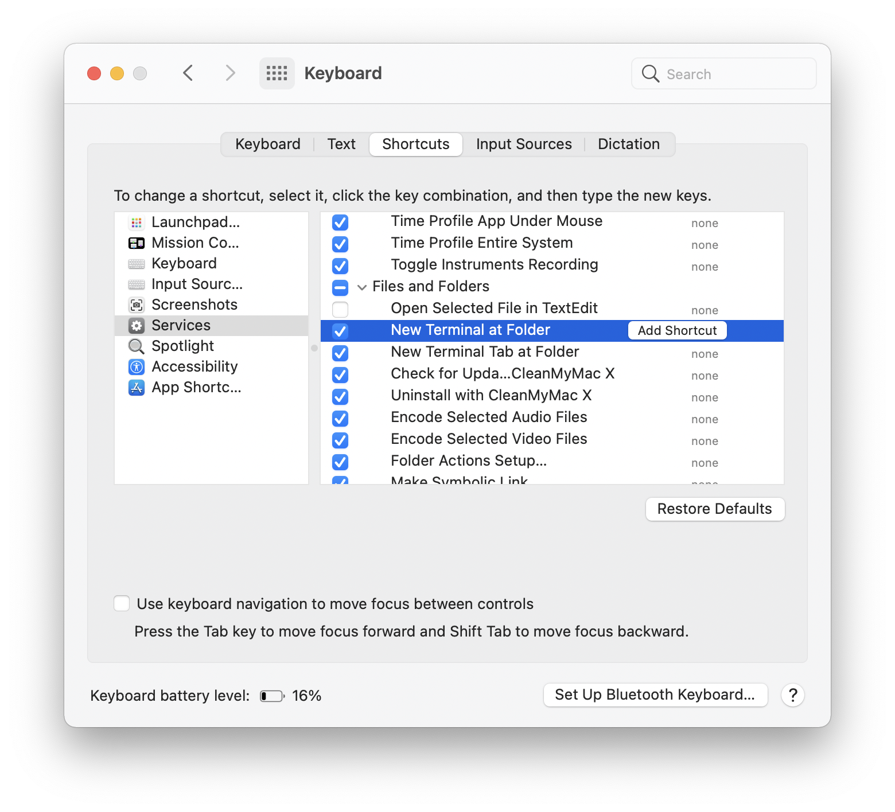
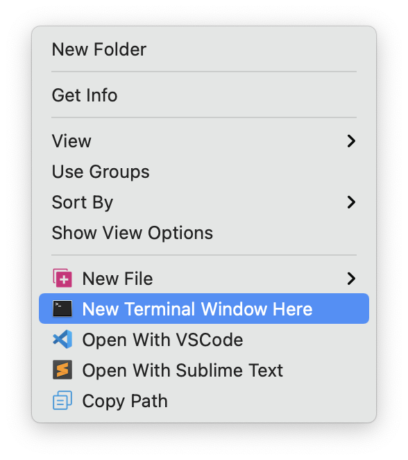
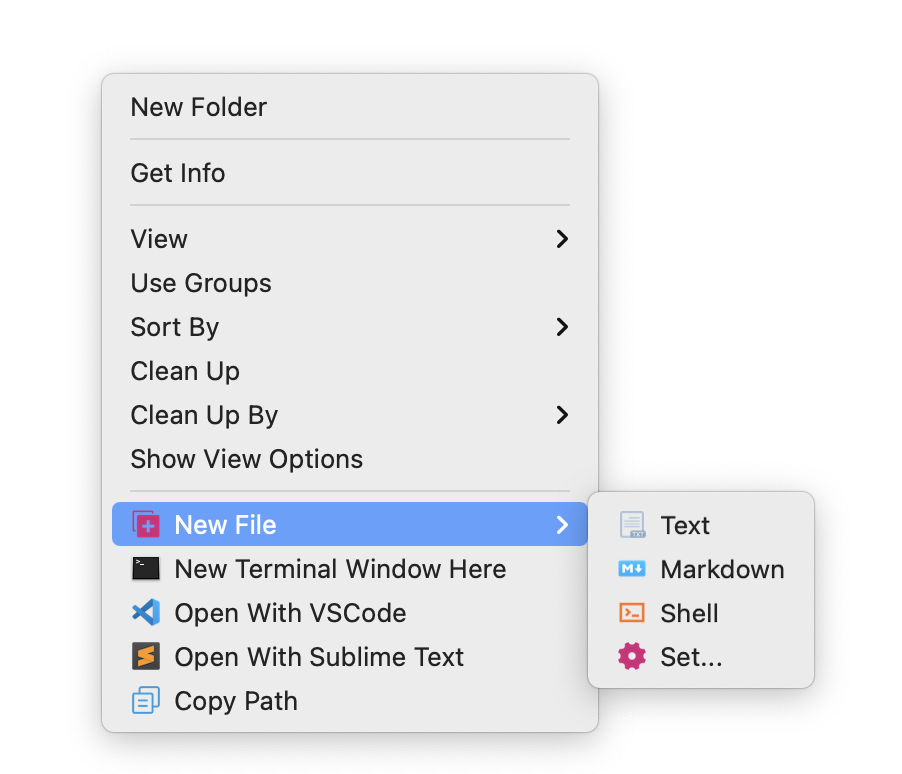
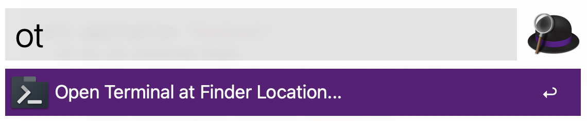

# Terminal 和 Finder 之间的跳转

你总是需要很快地从 Terminal 跳转到 Finder，与此同时，你也总是需要很快地从 Finder 跳转到 Terminal……

## 1. 从 Terminal 到 Finder

在 Terminal 中，想要在当前文件夹下打开 Finder，可使用以下命令：

```bash
open .
```

`open`，会使用系统默认方式打开某个文件，比如：

```bash
open readme.md 	# 在我的系统里，会用 Typora 打开 readme 文件
open /Applications/AppCleaner.app/ # 打开 Application 文件夹里的 AppCleaner.app 程序
open .	# . 代表所有，于是，系统会用 Finder 打开当前所在文件夹。
```

## 2. 从 Finder 到 Terminal

当前，你用 Finder 浏览到了某个文件夹，然后，你想用 Terminal 操作这个文件夹里的内容，这时，在 MacOS 的默认情况下，还挺麻烦，尤其是当那个文件夹名称很长（甚至不知道究竟是什么的时候）…… 

### 2.1 Finder 右键菜单

在 Finder 里选中一个文件夹，而后点击鼠标右键，最底部会有 `New Terminal Window at Folder`  以及 `New Terminal Tab at Folder`：



> **注意**
>
>  有些时候，这个 `New Terminal at Folder` 可能在右键菜单最底部的 Services 的字菜单中……

### 2.2 Finder 菜单

另外一个方法是点击屏幕上方的菜单条上的 Finder 字样，然后再点击 Servies，在字菜单中，可以看到 `New Terminal at Folder` 以及 `New Terminal Tab at Folder`：



使用这个系统内建的 Service 的讨厌之处在于，你只能在 Finder 中点中某个文件夹的时候才能使用它…… 可是，更多的时候，你已经在某个文件夹内，于是，你只好多点几下，先回到当前文件夹的上一层，然后再在众多文件与文件夹之中找到你想要的那个文件夹，而后再启用这个 Service...

这个 Service 是可以为其设置快捷键的。`System Preference` → `Keyboard` → `Shortcuts` → `Services` → `New Terminal at Folder`：



我以前为它设置过 `⇧⌘⌥t`（四个键的组合，Shift Command Option t），后来就算了，因为不再使用这个 Service 了。

### 2.3 GMRight Mouse 

最简单的办法是安装一个叫做 GMRight Mouse Lite 的软件（它也有 Pro 版本，收费，但，Lite 版本已经基本够用）。

```bash
mas install 1551462255 # Light 版本
mas install 1555844307 # pro 版本
```

有了它之后，我在 Finder 里，在某个文件夹内的空白处点击鼠标右键，是这样的：



GMRight Mouse，还提供了一个 New File 的快捷菜单，有很多模版，我选了 Text, Markdown, 和 Shell 这三个，因为我太常使用它们了。另外，那个 Copy Path，也是特别实用的，以后你就知道了。



### 2.4 AppleScript

GMRight Mouse 大多数情况下都很好，但，想要它打开 iCloud 目录，就不行了……  在 iCloud 文件夹内，你点鼠标右键，可能就看不到 GMRight 的功能了 —— 这也许是它的 bug...

你在 Finder 里是很容易找到 iCloud Drive 的，可是，在 Terminal 里，没人告诉你的话，你事先是没办法知道你得这样：

```bash
cd ~/Library/Mobile\ Documents/com~apple~CloudDocs
```

—— 更不用提对新手来说，根本无法知道，在 Terminal 的命令行里，文件名或者文件夹名里的空格，得在前面加上一个「脱字符」`\`……

我的办法是用 Script Editor 保存个脚本：

```js
tell application "Finder"
	if (count of windows) > 0 then
		set thePath to target of front window
	else
		display dialog "There are no open Finder windows." with icon caution buttons {"OK"} with title "Open Terminal Here..."
		return
	end if
end tell

if not (exists thePath) then
	tell application "Finder" to set theName to name of front window
	display dialog "The location of the Finder window \"" & theName & "\" is not a real location (e.g. smart folder, search, network, trash, etc) and cannot opened in Terminal." with icon caution buttons {"OK"} with title "Open Terminal Here..."
	return
end if
set thePath to quoted form of POSIX path of (thePath as alias)

tell application "Terminal"
	if it is running then
		-- This seems to be the only way to tell Terminal to open a new tab
		tell application "System Events"
			tell application process "Terminal"
				set frontmost to true
				try
					keystroke "t" using command down
				on error errMsg
					set msg to "Error: " & errMsg & "
This probably means that you're using Mojave and you will need to add this app to the \"Accessibility\" section in the \"Privacy\" tab of the \"Security & Privacy\" System Preferences.
Please see the \"Mojave\" section of the README for more details"
					display dialog msg buttons {"OK"} with icon caution with title "Open Terminal Here..."
					return
				end try
			end tell
		end tell
		do script "cd " & thePath & " && clear" in last tab of front window
	else
		do script "cd " & thePath & " && clear"
	end if
	activate
end tell
```

> **注意**
>
> 这个脚本当然不是我写的，是我在网上找到的：[Open-iTerm-or-Terminal-Here...](https://github.com/rkanter/Open-iTerm-or-Terminal-Here.../blob/master/applescripts/Terminal.applescript)

把这个脚本命名为 `OpenTerminalHere`（默认会保存在 iCloud 的文件夹里）；而后，需要的时候（比如，你刚刚用 Finder 浏览到某个文件夹），使用快捷键 `⌘ ␣`（Command 和 Space）呼出 Spotlight，输入到第五个字符，即， `opent` （不用等到你输入完全称）的时候，这个脚本应该已经排在第一位了，按 `⮐`（Return）就是执行该脚本，而后，Terminal 就应该打开，并且已经处于当前文件夹……

### 2.5 使用 Alfred

使用 AppleScript 当然也行，但，更方便的是在 Alfred 里添加一个 Keyword 工作流，用的就是上面的 Apple Script。你需要做的是，

> 1. 花钱购买 Alfred 这个软件的 Pro License
> 2. 下载并导入 "[Open Terminal Here..](https://github.com/xiaolai/apple-computer-literacy/blob/main/files/Open%20Terminal%20Here....alfredworkflow?raw=true) " 这个 Workflow（即，工作流）

当我需要的时候，我会用 `⌥ ␣`（Option 和 Space）呼出 Alfred 输入框，而后输入两个字符，`ot`，再按 `⮐`……



Alfred 软件非常灵活，也有很大的用处，花钱买它不亏。

还有另外一个 Alfred Workflow，[alfred-terminalfinder](https://github.com/LeEnno/alfred-terminalfinder)，增加四个快捷命令：

> - ft: open current Finder directory in Terminal
> - tf: open current Terminal directory in Finder
> - fi: open current Finder directory in iTerm
> - if: open current iTerm directory in Finder

