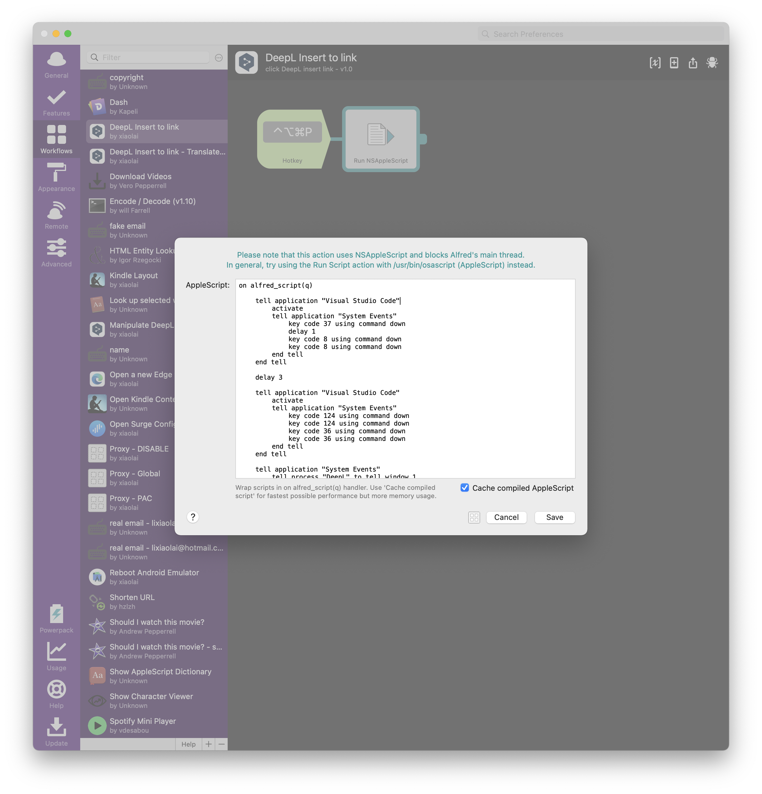
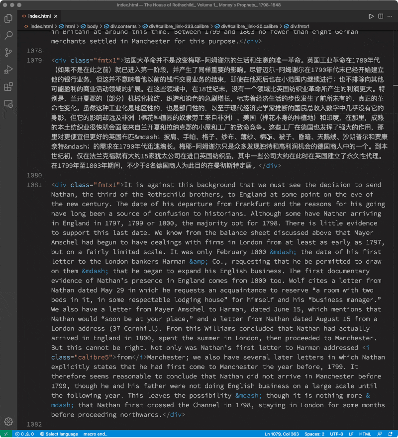

# 翻译工作环境

首先当然是 DeepL 的付费版。（国内的人，找个国外的朋友代为支付即可……）

其次是文字编辑器的选择。我选择的是 [Visual Studio Code](https://code.visualstudio.com/) —— 这是一个面向程序员设计的纯文本编辑器，但，并非只有程序员们才是用它…… 在进行翻译的时候，它成了最好的选择 —— 因为电子书目前最常见的格式都可以转换成 `html` 文本，用 MS Word 之类的编辑器事实上是很差的选择。另外，用 VSCode 可以做很多批处理 —— 不可或缺的功能。

## 电子书转换路径

我的电子书获取路径大致如下：

> Kindle > ePubor Ultimate > Calibre > htmz > vscode editing.

我都是在 Amazon 上直接买，而后在电脑上安装一个老版本的 Kindle App，用鼠标右键点击书名，下载，并不打开该电子书，而后退出 Kindle。

[ePubor Ultimate](https://www.epubor.com/) 也是个收费软件，能把旧版 Kindle 下载的电子书的 DRM 去掉；将 `awz` 文件 `epub` 文件。（可参考这个[网页](https://www.epubor.com/how-to-downgrade-kindle-for-pcmac.html)）

然后，再用免费软件 [Calibre](https://calibre-ebook.com/) 将 `epub` 转换成 `htmlz` 文件（一个压缩包）。（我尝试过使用命令行工具包 [pandoc](https://pandoc.org/)，但，比较之后，发现 Calibre 在保留样式方面可能更好一点……）

最后，再在 Terminal 里用 `unzip` 命令将 `htmlz` 文件解压缩。

整理一下文件夹，休整并补充一下 `style.css`，配上 `toc.css` 和 `toc.js`；最终，形成一个左侧带有固定目录（方便浏览和编辑时跳转）的 `html` 文件……

## 浏览器自动重载（Auto-reload）

* 为系统安装 nodejs 和 browser-sync
* 为浏览器（Microsoft Edge 或者 Google Chrome）安装 Live Load 插件
* 在 VSCode 中用快捷键 ```Ctrl + ` ``` 呼出显示在编辑器区域下部的 Terminal，输入 `serve` 命令……

> 更多参见这篇文章：
>
> [https://medium.com/@svinkle/start-a-local-live-reload-web-server-with-one-command-72f99bc6e855](https://medium.com/@svinkle/start-a-local-live-reload-web-server-with-one-command-72f99bc6e855)

## VS Code 插件

VSCode 的插件有很多，为了翻译任务，我只增加了以下三个插件。

* Chinese Translation（有时候 DeepL 会在简体中文中包含一些繁体中文内容，可以用这个插件提供的功能快速转换）
* DeepL for Visual Studio Code（DeepL 的付费用户才能用到这个插件）
* ssmacro（为 VSCode 提供 “批处理” 功能；对翻译工作来说，最重要的就是用它执行一系列的正则表达式替换）

## 一些代码

### vscode-deepl automation

DeepL 的软件上，`Insert to...` 是一个链接，并没有给出快捷键。于是，需要写个 AppleScript，模拟鼠标点击，而后可以用 Alfred 软件给这个脚本设定个快捷键（我设置的快捷键是 “ctrl+alt+cmd+p”）：



```applescript
tell application "Visual Studio Code"
	activate
	delay 2
	tell application "System Events"
		key code 37 using command down
		delay 1
		key code 8 using command down
		key code 8 using command down
	end tell
end tell
-- 以上是 cmd+l 选中当前整行；而后连续两次 cmd+c 将选中文字发给 DeepL

delay 5

tell application "Visual Studio Code"
	activate
	delay 2
	tell application "System Events"
		key code 124 using command down
		key code 124 using command down
		key code 36 using command down
	end tell
end tell

-- 以上是在 VSCode 中输入两个空行

-- 以下是模拟鼠标点击，按 DeepL 上的 “Insert to...” 链接
-- 也可以将以下部分，独立出来，单独为 “Insert to...” 设置个快捷键（我设置的是 “ctrl+alt+cmd+i”）
tell application "System Events"
	tell process "DeepL" to tell window 1
		activate
		set w_position to its position
		set w_size to its size
	end tell
end tell

set px to item 1 of w_position
set py to item 2 of w_position
set sx to item 1 of w_size
set sy to item 2 of w_size

tell application "System Events"
	click at {px + sx - 190, py + sy - 95} -- Insert to link
end tell
```

### 各种为翻译工作设定的快捷键

注意：在使用 VSCode 的时候，如果某些快捷键不起作用，很可能是因为 “当前输入法处于中文输入状态” 造成的。切换成英文输入法状态就好了…… 我最初的时候，设置了个快捷键，`ctrl+cmd+alt+\\`，这个快捷键就遇到了 “与输入法” 有所冲突的情况。后来，将这个快捷键改成了 `ctrl+cmd+alt+o`，就不受输入法影响了。

`keybindings.json`

```json
[
  {
    "key": "ctrl+shift+9",
    "command": "editor.action.insertSnippet",
    "args": {"snippet": "（$TM_SELECTED_TEXT$0）"},
    "when": "editorTextFocus&&editorHasSelection"
  },
  {
    "key": "ctrl+shift+'",
    "command": "editor.action.insertSnippet",
    "args": {"snippet": "“$TM_SELECTED_TEXT$0”"},
    "when": "editorTextFocus&&editorHasSelection"
  },
  {
    "key": "ctrl+'",
    "command": "editor.action.insertSnippet",
    "args": {"snippet": "‘$TM_SELECTED_TEXT$0’"},
    "when": "editorTextFocus&&editorHasSelection"
  },
  {
    "key": "ctrl+shift+[Backslash]",
    "command": "editor.action.insertSnippet",
    "args": {"snippet": "【$TM_SELECTED_TEXT$0】"},
    "when": "editorTextFocus&&editorHasSelection"
  },
  {
    "key": "ctrl+shift+[Slash]",
    "command": "editor.action.insertSnippet",
    "args": {"snippet": "《$TM_SELECTED_TEXT$0》"},
    "when": "editorTextFocus&&editorHasSelection"
  },
  {
    "key": "ctrl+shift+[BracketRight]",
    "command": "editor.action.insertSnippet",
    "args": {"snippet": "「$TM_SELECTED_TEXT$0」"},
    "when": "editorTextFocus&&editorHasSelection"
  },
  {
    "key": "ctrl+shift+[BracketLeft]",
    "command": "editor.action.insertSnippet",
    "args": {"snippet": "『$TM_SELECTED_TEXT$0』"},
    "when": "editorTextFocus&&editorHasSelection"
  },
  {
    "key": "ctrl+alt+cmd+-",
    "command": "editor.action.insertSnippet",
    "args": {"snippet": " —— "},
    "when": "editorTextFocus&&editorHasSelection"
  },
  {
    "key": "ctrl+shift+=",
    "command": "editor.action.insertSnippet",
    "args": {"snippet": " $TM_SELECTED_TEXT$0 "},
    "when": "editorTextFocus&&editorHasSelection"
  },
  {
    "key": "ctrl+shift+-",
    "command": "editor.action.insertSnippet",
    "args": {"snippet": "<p></p>"},
    "when": "editorTextFocus"
  },
  {
    "key": "ctrl+alt+cmd+a",
    "command": "editor.action.insertSnippet",
    "args": {"snippet": "<a href=\"\" target=\"_blank\">$TM_SELECTED_TEXT$0</a>"},
    "when": "editorTextFocus&&editorHasSelection&&editorLangId==html"
  },  
  {
    "key": "shift+ctrl+b",
    "command": "editor.action.insertSnippet",
    "args": {"snippet": "<strong>$TM_SELECTED_TEXT$0</strong>"},
    "when": "editorTextFocus&&editorHasSelection&&editorLangId==html"
  },
  {
    "key": "shift+ctrl+i",
    "command": "editor.action.insertSnippet",
    "args": {"snippet": "<em>$TM_SELECTED_TEXT$0</em>"},
    "when": "editorTextFocus&&editorHasSelection&&editorLangId==html"
  },
  {
    "key": "shift+ctrl+u",
    "command": "editor.action.insertSnippet",
    "args": {"snippet": "<u>$TM_SELECTED_TEXT$0</u>"},
    "when": "editorTextFocus&&editorHasSelection&&editorLangId==html"
  },
  {
    "key": "shift+ctrl+d",
    "command": "editor.action.insertSnippet",
    "args": {"snippet": "<del>$TM_SELECTED_TEXT$0</del>"},
    "when": "editorTextFocus&&editorHasSelection&&editorLangId==html"
  },{
    "key": "ctrl+tab",
    "command": "cursorRight",
    "when": "editorTextFocus&&!editorHasSelection"
  },
  {
    "key": "ctrl+alt+cmd+backspace",
    "command": "editor.emmet.action.removeTag"
  },
  {
    "key": "ctrl+shift+right",
    "command": "editor.emmet.action.matchTag",
    "when": "editorTextFocus&&editorLangId==html"
  },
  {
    "key": "ctrl+shift+l",
    "command": "editor.emmet.action.wrapWithAbbreviation"
  },
  {
    "key": "cmd+k b",
    "command": "workbench.action.toggleSidebarVisibility"
  },
  {
    "key": "shift+alt+d",
    "command": "editor.action.duplicateSelection"
  }
  ,{
    "key": "ctrl+alt+cmd+o",
    "command": "ssmacro.macro",
    "args": {"file": "regex.json"},
    "when": "editorTextFocus"
  }
]
```

以上的最后一段：

```json
  {
    "key": "ctrl+alt+cmd+o",
    "command": "ssmacro.macro",
    "args": {"file": "regex.json"},
    "when": "editorTextFocus"
  }
```

其中的 `“args”: {“file”:“regex.json”},` 有两种写法，一个是像这样用 `“file”:` 指定，那么这个文件应该在 `$HOME/.vscode/extensions/joekon.ssmacro-0.6.0/macros/` 文件夹内；第二种写法使用 `“path”:`，然后在其后设定批处理文件（`json`文件）的绝对路径。

### 为 ssmacro 设定的正则表达式批处理

```json
[
  {
    "command": "expandLineSelection"
  },
  {
    "command": "ssmacro.replace",
    "args": {
        "info": "半角方括号",
        "find": "\\[(.*?)\\]",
        "replace": "$1",
        "all": false,
        "reg": true,
        "flag": "gm"
    }
  },  
  {
    "command": "ssmacro.replace",
    "args": {
        "info": "直引号变成弯引号",
        "find": "\\s*\"(.*?)\\s*\"",
        "replace": "“$1”",
        "all": false,
        "reg": true,
        "flag": "gm"
    }
  },
  {
    "command": "ssmacro.replace",
    "args": {
        "info": "直引号变成弯引号",
        "find": "\\s*'(.*?)\\s*'",
        "replace": "‘$1’",
        "all": false,
        "reg": true,
        "flag": "gm"
    }
  },
  {
    "command": "ssmacro.replace",
    "args": {
        "info": "上一步误伤的直引号",
        "find": "=“(.*?)”",
        "replace": "=\"$1\"",
        "all": false,
        "reg": true,
        "flag": "gm"
    }
  },  
  {
    "command": "ssmacro.replace",
    "args": {
        "info": "弯引号之前的空格",
        "find": "([\u4e00-\u9fa5])“",
        "replace": "$1 “",
        "all": false,
        "reg": true,
        "flag": "gm"
    }
  },  
  {
    "command": "ssmacro.replace",
    "args": {
        "info": "弯引号之后的空格",
        "find": "”([\u4e00-\u9fa5])",
        "replace": "” $1",
        "all": false,
        "reg": true,
        "flag": "gm"
    }
  },

  {
    "command": "ssmacro.replace",
    "args": {
        "info": "中文斜体转换成中文加重",
        "find": "<i (.*?)>([\u4e00-\u9fa5]+)</i>",
        "replace": "<strong $1>$2</strong>",
        "all": false,
        "reg": true,
        "flag": "gm"
    }
  },
  {
    "command": "ssmacro.replace",
    "args": {
        "info": "省略号",
        "find": "\\.{2,}\\s*。*\\s*",
        "replace": "…… ",
        "all": false,
        "reg": true,
        "flag": "gm"
    }
  },
  {
    "command": "ssmacro.replace",
    "args": {
        "info": "破折号",
        "find": "&mdash；|&mdash;|--",
        "replace": " —— ",
        "all": false,
        "reg": true,
        "flag": "gm"
    }
  },
  {
    "command": "ssmacro.replace",
    "args": {
        "info": "姓名之间的 ·",
        "find": "([\u4e00-\u9fa5])-([\u4e00-\u9fa5])",
        "replace": "$1·$2",
        "all": false,
        "reg": true,
        "flag": "gm"
    }
  },
  {
    "command": "ssmacro.replace",
    "args": {
        "info": "姓名之间的 ·",
        "find": "([\u4e00-\u9fa5])-([\u4e00-\u9fa5])",
        "replace": "$1·$2",
        "all": false,
        "reg": true,
        "flag": "gm"
    }
  },
  {
    "command": "ssmacro.replace",
    "args": {
        "info": "数字前的空格",
        "find": "([\u4e00-\u9fa5])(\\d)",
        "replace": "$1 $2",
        "all": false,
        "reg": true,
        "flag": "gm"
    }
  },
  {
    "command": "ssmacro.replace",
    "args": {
        "info": "数字后的空格 —— 含 %",
        "find": "([\\d%])([\u4e00-\u9fa5])",
        "replace": "$1 $2",
        "all": false,
        "reg": true,
        "flag": "gm"
    }
  },
  {
    "command": "ssmacro.replace",
    "args": {
        "info": "英文字母前的空格",
        "find": "([\u4e00-\u9fa5])(\\w)",
        "replace": "$1 $2",
        "all": false,
        "reg": true,
        "flag": "gm"
    }
  },   
  {
    "command": "ssmacro.replace",
    "args": {
        "info": "英文字母后的空格",
        "find": "(\\w)([\u4e00-\u9fa5])",
        "replace": "$1 $2",
        "all": false,
        "reg": true,
        "flag": "gm"
    }
  },
  {
    "command": "ssmacro.replace",
    "args": {
        "info": "后：斜体英文与汉字之间的空格",
        "find": "([\u4e00-\u9fa5])<i",
        "replace": "$1 <i",
        "all": false,
        "reg": true,
        "flag": "gm"
    }
  },
  {
    "command": "ssmacro.replace",
    "args": {
        "info": "前：斜体英文与汉字之间的空格",
        "find": "i>([\u4e00-\u9fa5])",
        "replace": "i> $1",
        "all": false,
        "reg": true,
        "flag": "gm"
    }
  },
  {
    "command": "ssmacro.replace",
    "args": {
        "info": "双引号前的逗号",
        "find": "，”",
        "replace": "”，",
        "all": false,
        "reg": true,
        "flag": "gm"
    }
  },
  {
    "command": "ssmacro.replace",
    "args": {
        "info": "逗号、句号、感叹号、问号后面多余的空格",
        "find": "([，。！？]) ",
        "replace": "$1",
        "all": false,
        "reg": true,
        "flag": "gm"
    }
  },
  {
    "command": "ssmacro.right"
  }
]
```

用 ssmacro 批处理进行正则表达式替换的效果大致如下：


