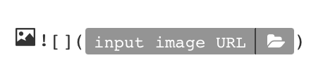
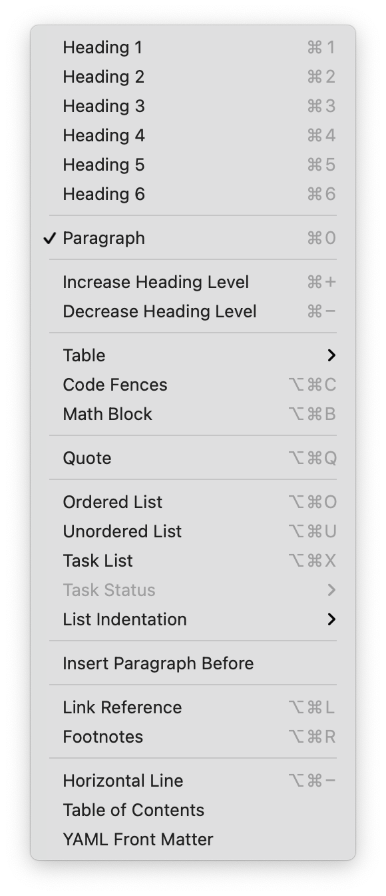
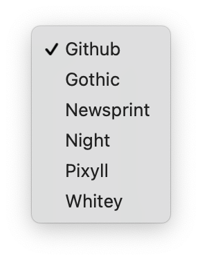

# Typora

Markdown 是一种极致简单的文本标记格式，今天已经成了互联网写作发布的最普遍方式。Markdown 的作者是 [Aaron Swartz](https://en.wikipedia.org/wiki/Aaron_Swartz)。一般文件名称以 `.md` 或者 `.markdown` 作为尾缀。

[Typora](https://typora.io/) 是 MacOS 上目前最好用的 Markdown 编辑器，缺点是没有 iOS 版本 —— 也就是说，在 iPad 上无法像 Craft、Bear 那样相互通用且共享文件，不过，的确绝大多数写作都是在 Mac 上完成的。

自从开始使用 Markdown 之后，Microsoft Word 和 Apple Pages 都成了基本处于弃用的状态。Microsoft Word，现在我只是在直播的时候，把它当作白板使用（因为可以设置很多与格式有关的快捷键）；Apple Pages 么，虽然顺手安装了，可真的很久很久没打开用了。

```bash
brew install typora
```

以下是官方示例视频：

<video autoplay="" muted="muted" preload="preload" loop="loop" style="border-radius: 8px;box-shadow: 0px 0px 8px 3px #ccc;" src="https://typora.io//img/beta.mp4"></video>

第一个要熟悉的快捷键是 `⌘/` —— 在 Souce Code Mode（源码）和 Rendered Text（渲染后文本）之间切换。

与文本格式相关的最基本快捷键，都在 Format 菜单里：


比如，你想要插入图片，那就是 `⌃ ⌘ i` （在以上菜单中，Image 子菜单里可以看到），按下这个快捷键之后，会出现



然后点文件夹图标，选择图片即可。

 Paragraph 菜单里有更多与段落和整篇相关的快捷键：



Typora 提供很多 Theme，我一直用 Github：



—— 这样的好处是，我平时编辑的样子，就是我发布在 Github 上的样子。

Typora 的设置面板也很简单直观 —— 基本上，默认的设置就很够用了。