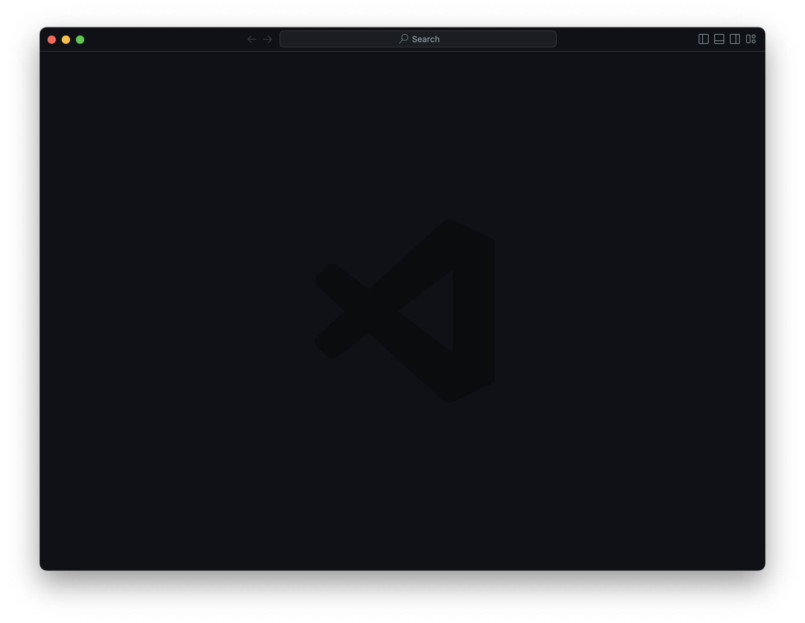
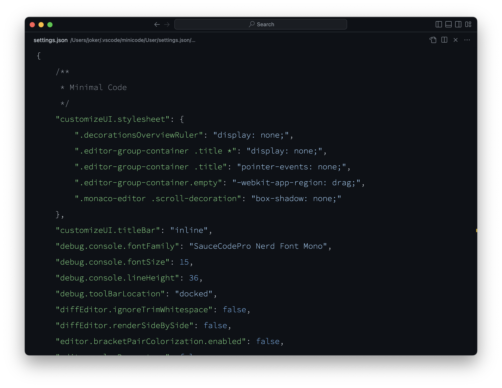

# Visual Studio Code

## 使用 "SauceCodePro Nerd" 字体

Settings UI 里没有对 Font-Weight 的选项，所以，只能在 `settings.json` 里编辑设置：

```json
    // 在文件最末位 `}` 的上一行添加：
    "editor.fontFamily": "'SauceCodePro Nerd Font Mono'",
    "editor.fontSize": 17,
    // 相当于 ExtraLight：
    "editor.fontWeight": "200",
    // 不要忘记设置 Terminal 窗口的字体
    "terminal.integrated.fontSize": 16,  
    "terminal.integrated.fontWeight": "200",
```

## 使用独立的 User Profile 文件夹

命令行中使用以下命令：

```bash
code --extensions-dir $HOME/.vscode/js/extentions --user-data-dir $HOME/.vscode/js/user"
```

* 在 `~/.vscode/js/extentions/` 里保存扩展插件；
* 在 `~/.vscode/js/user/` 里保存用户设置……

## 极简版本 VSCode 

很多的时候，我们只想快速编辑一个文本文件，那么，VS Code 的默认洁面就显得 “臃肿” 和 “多余” 了…… 可以专门设定一个 “极简版本”。

### 1. 在 Termial 中执行以下命令：
   
```bash
code --user-data-dir $HOME/.vscode/minicode --extensions-dir $HOME/.vscode/minicode/extentions
```

这个意思是说，在 `~/.vscode/minicode` 下保存用户数据，在 `~/.vscode/minicode/extentions` 下保存为其安装的擦肩。

### 2. 在新打开的 VSCode 中，安装两个插件：

> * Customize UI
> * Github Theme

### 3. 按下快捷键 `SHIFT + COMMAND + p` 呼出命令板，找到 `Preferences: Open User Settings (JSON)`，将 `settings.json` 的文件夹内容替换为：

> 注意，在此之前，我[已经安装](start-from-terminal.md#7.%20Terminal%2(2))过 `SauceCodePro Nerd Font Mono` 字体。

```json
{
    /**
     * Minimal Code
     */
    "customizeUI.stylesheet": {
        ".decorationsOverviewRuler": "display: none;",
        ".editor-group-container .title *": "display: none;",
        ".editor-group-container .title": "pointer-events: none;",
        ".editor-group-container.empty": "-webkit-app-region: drag;",
        ".monaco-editor .scroll-decoration": "box-shadow: none;"
    },
    "customizeUI.titleBar": "inline",
    "debug.console.fontFamily": "SauceCodePro Nerd Font Mono",
    "debug.console.fontSize": 15,
    "debug.console.lineHeight": 36,
    "debug.toolBarLocation": "docked",
    "diffEditor.ignoreTrimWhitespace": false,
    "diffEditor.renderSideBySide": false,
    "editor.bracketPairColorization.enabled": false,
    "editor.colorDecorators": false,
    "editor.cursorStyle": "line-thin",
    "editor.fontFamily": "SauceCodePro Nerd Font Mono",
    "editor.fontWeight": "200",
    "editor.fontLigatures": true,
    "editor.fontSize": 18,
    "editor.formatOnSave": true,
    "editor.glyphMargin": false,
    "editor.gotoLocation.multipleDeclarations": "goto",
    "editor.gotoLocation.multipleDefinitions": "goto",
    "editor.gotoLocation.multipleImplementations": "goto",
    "editor.gotoLocation.multipleReferences": "goto",
    "editor.gotoLocation.multipleTypeDefinitions": "goto",
    "editor.guides.indentation": false,
    "editor.hideCursorInOverviewRuler": true,
    "editor.lineHeight": 36,
    "editor.lineNumbers": "off",
    "editor.matchBrackets": "near",
    "editor.minimap.enabled": false,
    "editor.occurrencesHighlight": false,
    "editor.renderLineHighlight": "none",
    "editor.renderWhitespace": "none",
    "editor.scrollbar.horizontalScrollbarSize": 8,
    "editor.scrollbar.verticalScrollbarSize": 8,
    "explorer.compactFolders": false,
    "explorer.decorations.badges": false,
    "explorer.openEditors.visible": 0,
    "git.enableSmartCommit": true,
    "git.confirmSync": false,
    "markdown.preview.markEditorSelection": false,
    "problems.decorations.enabled": false,
    "scm.diffDecorations": "none",
    "terminal.integrated.cursorStyle": "line",
    "terminal.integrated.enableMultiLinePasteWarning": false,
    "terminal.integrated.fontSize": 15,
    "terminal.integrated.lineHeight": 1.85,
    "window.autoDetectColorScheme": true,
    "window.newWindowDimensions": "inherit",
    "window.title": "${rootName}",
    "window.titleBarStyle": "inline",
    "workbench.activityBar.visible": false,
    "workbench.colorTheme": "GitHub Dark Default",
    "workbench.editor.enablePreview": false,
    "workbench.editor.revealIfOpen": true,
    "workbench.editor.showTabs": false,
    "workbench.editor.untitled.hint": "hidden",
    "workbench.iconTheme": null,
    "workbench.list.horizontalScrolling": true,
    "workbench.preferredDarkColorTheme": "GitHub Dark Default",
    "workbench.preferredLightColorTheme": "GitHub Light Default",
    "workbench.startupEditor": "none",
    "workbench.statusBar.visible": false,
    "workbench.tips.enabled": false,
    "workbench.tree.indent": 16,
    "workbench.tree.renderIndentGuides": "none",
    "editor.inlineSuggest.enabled": true,
    "security.workspace.trust.startupPrompt": "never",
    "security.workspace.trust.enabled": false,
    "security.workspace.trust.emptyWindow": false,
    "editor.tabSize": 2
}
```

### 4. 为极简版 VSCode 设置一个 alias

在 `.zshrc` 里添加一行：

```bash
alias mcode="code --user-data-dir $HOME/.vscode/minicode --extensions-dir $HOME/.vscode/minicode/extentions"
```

而后重新启动 Terminal，以后就可以用 `mcode <filename>` 打开极简版 VSCode 并编辑一个文件了。

### 5. 效果展示

未打开任何文件的状态：



编辑文件时的状态：

