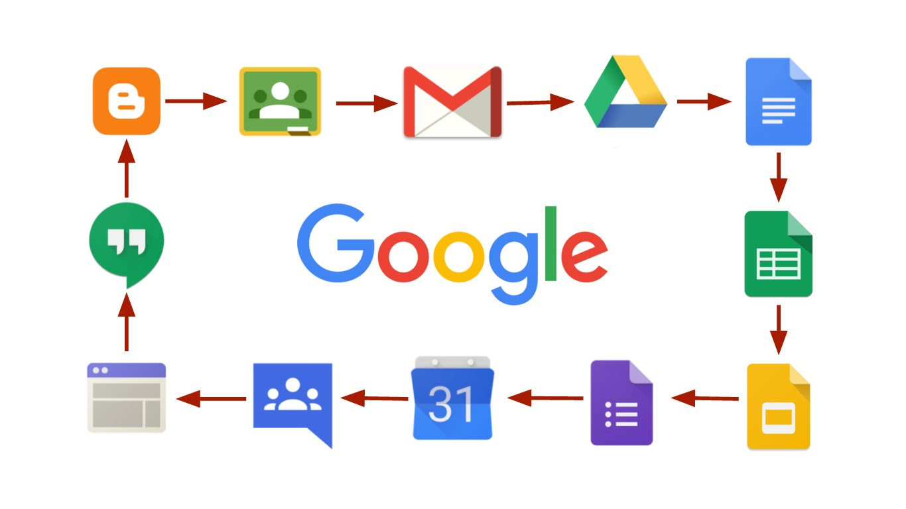
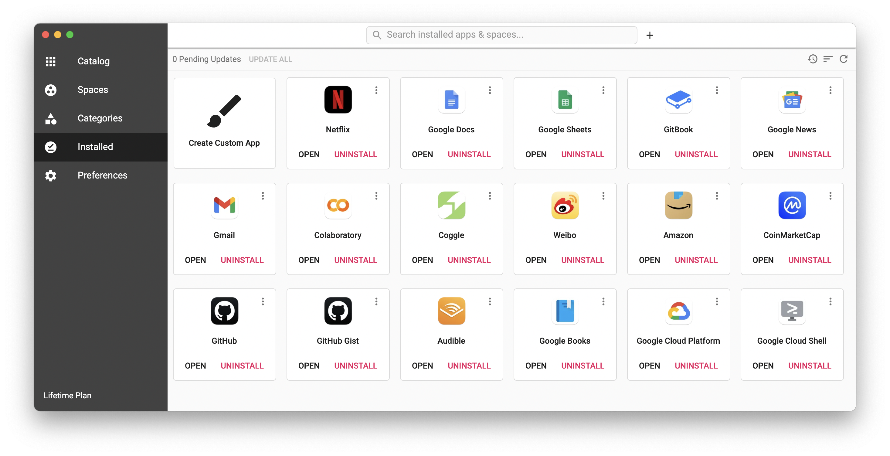

# Webcatalog

现在，网上有大量的「网站」与安装在操作系统上的 App（程序）一样提供专门的服务。比如，Google 提供的就很多（实际上多大 270+ 种）：



过去我习惯用 [Nativefier](https://github.com/nativefier/nativefier) 把一些网站打包成 MacOS App 使用，现在，直接买 [Webcatalog](https://webcatalog.io) 完成这个功能了，现在还在用 Nativefier 打包的，只剩下一个本地的 JupyterLab Service 了。Webcatalog 的 Lifetime Licence 收费 $40，挺好。看了一眼，现在我用它打包了 16 个网络服务。



Webcatalog 也可以通过 Homebrew 安装

```bash
brew install webcatalog
```

值得一提的是，如此这般之后，我干脆不用 MacOS 上的 Mail 了，因为 Gmail 变成了 App。这里我用的最多的是，Coogle 和 Google Sheets —— 都是 Google 的。

如此这般之后，我的软件，除了极个别的之外（比如 [Mixin Desktop](https://mixin.one/messenger)），都可以用 [Homebrew](start-from-terminal.md) 和 Webcatalog 搞定。

